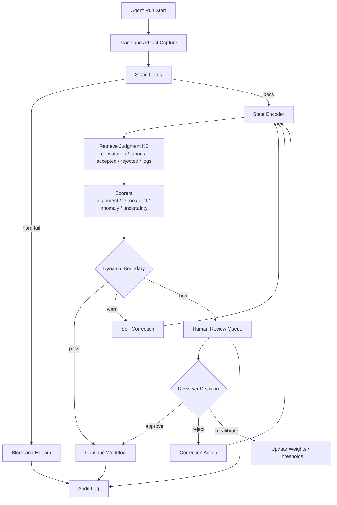
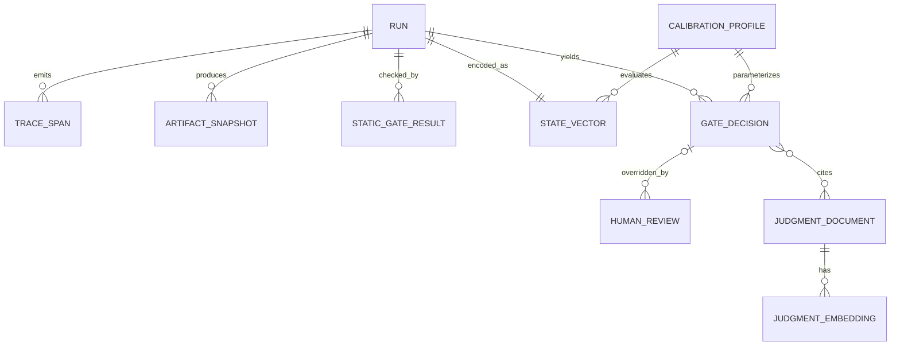

# 要件定義書

## エグゼクティブサマリ

本書は、既存ハーネスに「工程ゲートの状態空間化」を追加するための要件定義書である。ここでいう追加対象は、モデルやツール実行の“計算面”ではなく、既存ハーネスが担う“制御面”である。entity["company","OpenAI","ai company"] の Agents SDK ドキュメントは、ハーネスを「agent loop、model calls、tool routing、handoffs、approvals、tracing、recovery、run state を所有する control plane」と定義しており、本要件もその制御面に対して新しい判定層を差し込む前提で設計する。citeturn13view3turn13view2

基本方針は、**静的ゲートを残したまま、その上位に状態空間ゲートを重ねる二層構成**である。静的ゲートはテスト、型、SAST、秘密情報、ライセンス、危険ツール呼び出しなど、決定論的に落とせる項目を担当する。一方、状態空間ゲートは、設計憲法、禁忌、採用例、却下例、判断ログ、履歴的ドリフト、異常値、モデル不確実性といった、文脈依存かつ履歴依存の判断を扱う。これは、OpenAI の traces / graders / datasets / eval runs、entity["company","Anthropic","ai company"] の評価・監視・介入重視のエージェント運用指針、そして entity["company","LangChain","llm tooling"] の LangSmith / LangGraph における observability、online eval、annotation queue、interrupt / persistence の運用パターンと整合する。citeturn13view0turn19view0turn13view5turn14view6turn13view6turn13view8turn15view3

人間の役割は、全文レビュー担当ではなく、**逸脱監視と境界調律の担当**に再定義する。Anthropic は、経験を積んだ利用者ほど「各アクション承認」から「監視して必要時に介入」へシフトすると報告しており、LangGraph の checkpointer/interrupt はその運用を成立させるための基盤を提供する。本要件でも、日常運用はダッシュボードによる観測、重大アラート時の介入、誤判定時の重み・閾値修正、判断ログの追記を中心に設計する。citeturn14view6turn13view8turn13view6turn13view11turn25view0

セキュリティ設計は、entity["organization","OWASP","security foundation"] の 2025 LLM Top 10 を最優先の脅威分類として採用する。特に LLM01 Prompt Injection、LLM05 Improper Output Handling、LLM06 Excessive Agency、LLM08 Vector and Embedding Weaknesses、LLM10 Unbounded Consumption は、本要件の静的ゲート・状態空間ゲート・人間介入設計に直結する。また、entity["organization","NIST","us standards agency"] の Generative AI Profile は、生成 AI 固有リスクを識別し、組織的なリスク管理行動へ落とすための上位枠組みとして参照する。citeturn17view0turn13view15turn18view3

本書では、要件定義を完了状態として扱うため、初期リリースに必要な項目へ正式初期値を与える。既存ハーネスは adapter 契約で吸収し、対象リポジトリ、保存期間、レイテンシ目標、SLO/SLA、月額予算上限、データレジデンシー、PII ポリシー、レビュー体制は本書の値を初期リリース契約値とする。将来の変更は calibration profile、policy version、または change request で管理する。  

## 背景と基本方針

### 目的と背景

目的は、AIエージェント成果物の品質保証を「人間が毎回成果物を全文レビューする運用」から、「ハーネスが成果物と工程の状態を継続観測し、危険な逸脱だけを人間に上げる運用」へ移行することである。OpenAI の Agents SDK は、guardrails と human review によって run を continue / pause / stop できること、tracing により model call、tool call、handoff、guardrail などの構造化記録を残せること、agent evals により traces / datasets / graders / eval runs で改善ループを回せることを明示している。本要件は、その枠組みの上に「状態空間ゲート」を追加する設計である。citeturn13view1turn13view2turn13view0turn19view0

背景には、エージェントの自律性が有用性と同時に新しい運用リスクを増やす、という前提がある。Anthropic は、エージェントが人間意図を取り違えて不適切な行動を取る余地、prompt injection に騙される余地、事後監視と簡単な介入機構への投資の必要性を強調している。OWASP 2025 も、Prompt Injection、Excessive Agency、Vector and Embedding Weaknesses、Unbounded Consumption などを主要リスクとして整理している。したがって、状態空間ゲートは「便利な追加機能」ではなく、エージェント運用の信頼性・安全性・説明可能性を担保するための制御機構として定義する必要がある。citeturn13view5turn14view6turn17view0turn13view14

### スコープ

| 区分 | 内容 |
|---|---|
| 対象 | 既存ハーネスの制御面への追加。具体的には trace 収集、静的ゲート実行結果の取り込み、状態ベクトル生成、判断知識ベース検索、スコアリング、動的境界判定、人間介入、監査ログ、閾値調律、再評価ループ |
| 対象 | コード生成・ドキュメント生成・仕様差分・ツール実行・PR提案・テスト追加など、ハーネスが管理する成果物と工程イベント |
| 対象 | 静的ゲートと状態空間ゲートのハイブリッド設計、ならびに shadow mode からの段階導入 |
| 非対象 | 基盤 LLM そのものの学習、再学習、重み更新 |
| 非対象 | 既存 CI/CD や SAST 製品の全面置換 |
| 非対象 | すべての業務領域に共通な万能ポリシー設計。プロジェクト固有の設計憲法や禁忌の中身は別途定義が必要 |
| 対象 | 初期リリースに必要な保存期間、データレジデンシー、PII/機密ポリシー、SLA/SLO、月額予算上限、reviewer 体制の正式初期値 |

### 初期リリース確定事項

本書は調査結果を含む要件定義であるが、初期リリースの契約値は以下に固定する。ここで定義した値は production block enforce までの基準値であり、変更する場合は policy version を更新し、replay evaluation を再実行する。

| 項目 | 正式初期値 | 備考 |
|---|---|---|
| 対象成果物 | code patch、document diff、tool execution plan、PR proposal | 初期対象。binary artifact と本番データ更新 run は対象外 |
| 対象環境 | local / CI / staging / production shadow / production enforce | production enforce は本書の Readiness Gates を満たした時点で有効 |
| 対象 repo / service | `agent-gatefield` を初期対象、以後は repo profile 追加で拡張 | 複数 repo 展開は profile 単位で実施 |
| 既存ハーネス | Python adapter-first 実装、OTel trace、checkpoint 参照、tool policy hook を必須契約とする | 実装差異は harness adapter で吸収 |
| ゲート動作 | shadow mode 2週間 → warn/hold enforce 1週間 → block enforce | KPI と acceptance を満たさない場合は fail closed で延長 |
| 静的ゲート | test、type/lint、secret scan、tool policy、SAST、license scan を P0 必須 | SAST/license は adapter が unavailable の場合のみ `hold` に縮退 |
| 状態空間ゲート | semantic、taboo、accepted/rejected、judgment log、drift、uncertainty | MVP では active learning 自動化は対象外 |
| review 体制 | reviewer 2 名以上、Security approver 1 名、Ops owner 1 名 | rota は role base で設定し、個人名は運用台帳で管理 |
| データレジデンシー | self-hosted Postgres/pgvector と redacted payload store を既定、外部 managed service は無効 | 外部利用時は別 change request |
| PII/機密ポリシー | raw prompt / raw tool payload は保存禁止。artifact body は redaction 後のみ保存可 | 分類不能 payload は restricted |
| 月額予算上限 | 初期 $500/月相当。80% で warn、100% で hold | 為替・クラウド単価差は Finance profile で管理 |
| SLA/SLO | Critical ACK 15分/判断60分、High ACK 60分/判断240分、dashboard freshness 60秒、review writeback 5秒 | 詳細は SLA 表に従う |
| 成功判定 | 技術受入基準と運用 KPI の両方を満たす | 片方が未達の場合は fail closed で shadow または warn/hold enforce に留める |

初期リリースでは、上記を正式初期値として扱う。運用実態に合わせて変更する場合は、変更前後の dataset / threshold / policy version を保存し、replay reproducibility を再確認する。

### 要件凍結レベルと正式初期値

本書の要件凍結レベルは **Production Requirements Frozen** とする。MVP の実装範囲、受入基準、状態遷移、データ保護、評価データセット仕様に加え、production enforce に必要な組織・規制・予算・運用品質の契約値も以下の通り固定する。

| 項目 | 正式初期値 | 完了条件 | Owner |
|---|---|---|---|
| 既存ハーネス実体 | Python adapter-first、OTel event schema、pause/resume checkpoint reference、pre-tool policy hook | adapter contract test が通る | Platform |
| 対象 repo / service | `agent-gatefield`、artifact type は code patch / document diff / tool execution plan / PR proposal | repo profile が config に存在する | Product / Repo Owner |
| データレジデンシー | self-hosted local/controlled infrastructure。外部 managed service は初期無効 | data protection config と purge dry-run が通る | Security / Legal |
| PII / 機密ポリシー | raw prompt/tool payload 保存禁止、restricted は embedding 禁止、artifact は redaction 後のみ | redaction test と incident response drill が通る | Security |
| SLA / SLO | Critical 15/60分、High 60/240分、freshness 60秒、writeback 5秒、replay reproducibility 99%以上 | KPI dashboard が値を収集する | Ops / Product |
| 月額予算上限 | $500/月相当、80% warn、100% hold | cost alert が設定される | Product / Finance |
| Reviewer 体制 | reviewer 2 名以上、Security approver 1 名、Ops owner 1 名、timeout escalation は fail closed | rota が運用台帳に登録される | Ops / Security |
| 評価データ | acceptance split は redaction 済み、version lock 必須、2 reviewer label 必須 | dataset manifest が audit log に保存される | QA / Repo Owner |

このため、現時点の判定は「要件定義として production block enforce まで完成」である。実際の rollout では、本書の Readiness Gates に沿って証跡を確認し、条件未達時は fail closed で shadow または warn/hold enforce に留める。

### 要件 ID とトレーサビリティ

MVP の実装・検収・レビューで参照しやすいよう、主要要件に安定 ID を付与する。詳細仕様は後続節を正とし、この表は要求、証跡、検収条件をつなぐ索引として扱う。

| ID | 要件 | 主な証跡 | 検収条件 |
|---|---|---|---|
| AGF-REQ-001 | 既存ハーネスの run lifecycle event を購読し、run / trace / artifact を相関できる | trace event sample、adapter contract test | 対象 run の 95%以上で trace + state vector が生成される |
| AGF-REQ-002 | 静的ゲートで hard fail を決定論的に block する | static violation suite、scanner evidence | seeded static violation suite に対し 100% block |
| AGF-REQ-003 | 状態空間ゲートで semantic / taboo / accepted / rejected / drift / uncertainty を評価する | scorer output、state vector、threshold version | taboo recall 0.90 以上、AUC 0.85 以上または PR-AUC 0.80 以上 |
| AGF-REQ-004 | `pass / warn / hold / block` の状態遷移と fail-closed timeout を実装する | decision packet、review queue log、timeout event | high privilege action が risk/uncertainty/taboo 条件で hold/block される |
| AGF-REQ-005 | reviewer correction を judgment log と calibration profile に反映する | human review record、correction writeback log | correction が replay 可能 state へ反映される |
| AGF-REQ-006 | raw prompt / raw tool payload を原則保存せず、分類不能 payload は restricted として扱う | redaction log、classification metadata、purge test | 保存 payload の 100% に data_classification / redaction_status / retention_class が存在 |
| AGF-REQ-007 | acceptance dataset を version lock し、calibration / validation / acceptance split を分離する | dataset manifest、label review record | acceptance split の 100% が redaction 済み、replay reproducibility 99%以上 |
| AGF-REQ-008 | shadow → warn/hold enforce → block enforce の段階移行を運用 KPI で制御する | KPI dashboard、shadow report | review load reduction 30%以上、critical miss rate 0%、high miss rate 5%以下 |
| AGF-REQ-009 | decision packet を OTel trace と audit event に二重化保存する | audit event、trace_id/span_id correlation | gate decision の 100% に trace_id / threshold_version / action_type が存在 |
| AGF-REQ-010 | production block enforce は正式初期値と Readiness Gates に従って段階有効化する | readiness review、owner approval、KPI dashboard | Product Readiness Gates の Block enforce 条件をすべて満たす |
| AGF-REQ-011 | `agent-state-gate` adapter が利用する `/v1/*` HTTP surface を提供する | adapter contract test、DecisionPacket fixture、health check | `/v1/evaluate` が DATA_TYPES_SPEC v1.0.0 の DecisionPacket を返し、`/v1/decisions/{decision_id}`、`/v1/state-vectors/{run_id}`、`/v1/audit/{run_id}` が参照可能 |

### Definition of Done

MVP 下書き要件の完成条件は以下とする。

| 区分 | 完了条件 |
|---|---|
| 要件本文 | スコープ、初期リリース確定事項、ハーネス契約、状態遷移、データ保護、評価データ、受入基準、正式初期値が同一文書内で相互参照できる |
| 周辺文書 | README、architecture、security、tasks、datasets、config が requirements の主要決定と矛盾しない |
| 検収入口 | `docs/EVALUATION.md` から受入基準、KPI、証跡、正式初期値を確認できる |
| 実装入口 | `config/gate-config.yaml` に MVP 既定値、データ保護、KPI、dataset lock が表現されている |
| 承認準備 | production enforce に必要な正式初期値、Owner、完了条件、fail-closed 条件が付いている |

### 既存ハーネス連携契約

状態空間ゲートは既存ハーネスの control plane に差し込むため、ハーネスとの契約を要件として固定する。既存ハーネスがこの契約を満たさない場合は、ゲート本体より前に adapter / shim を実装する。

| 契約 | 必須度 | 内容 | 未対応時の扱い |
|---|---|---|---|
| Run lifecycle events | P0 | `run_started`、`step_started`、`tool_call_requested`、`artifact_emitted`、`static_gate_completed`、`run_completed`、`run_failed` を購読できる | trace adapter を P0 追加 |
| Pause / resume | P0 | `hold` 判定時に run を停止し、reviewer decision 後に同じ checkpoint から再開できる | hold は block 扱いに縮退 |
| Tool policy hook | P0 | tool call 前に deny / hold / allow を返せる同期 hook を持つ | 高権限 tool は MVP 対象外 |
| Artifact snapshot | P0 | 判定対象 artifact の hash、diff、生成元 step、commit/branch を取得できる | state vector 生成不可として run 対象外 |
| Static gate result ingest | P0 | 既存 CI / scanner の status、severity、evidence_ref を取り込める | static gate adapter を追加 |
| Trace correlation | P0 | trace_id / span_id / run_id を全 event に付与できる | audit completeness 受入不可 |
| Reviewer callback | P1 | approve / reject / recalibrate / correction request を run state に反映できる | dashboard は参照のみ、resume は CLI で代替 |
| Replay | P1 | 過去 run を threshold_version / policy_version 指定で再評価できる | enforce 前の acceptance で必須化 |
| Policy versioning | P1 | prompt / tool / gate config / threshold の version を run に紐づける | 監査ログに config hash を保存して代替 |

ハーネス API の最小 I/O 契約は以下とする。

```json
{
  "run_id": "uuid",
  "trace_id": "otel-trace-id",
  "event_type": "tool_call_requested",
  "timestamp": "RFC3339",
  "actor": "agent|tool|reviewer|system",
  "artifact_ref": "artifact://...",
  "checkpoint_ref": "checkpoint://...",
  "policy_version": "gate-policy-v1",
  "payload_ref": "blob://redacted-or-hashed"
}
```

adapter は payload の完全本文ではなく、原則として hash / redacted payload / scoped reference を渡す。状態空間ゲートが本文を必要とする場合でも、データ分類と redaction が完了していない payload は処理対象外にする。

### agent-state-gate 連携契約

`agent-state-gate` は統合 gate 層であり、`agent-gatefield` の判定ロジックを再実装しない。連携境界は `DecisionPacket` と StateVector の参照 API とする。

| Method | Endpoint | 入力 | 出力 |
|---|---|---|---|
| `GET` | `/v1/health` | なし | `{status: "ok"}` |
| `POST` | `/v1/evaluate` | `artifact_id`, `artifact_ref`, `diff_hash`, `trace`, `rule_results` | DATA_TYPES_SPEC v1.0.0 `DecisionPacket` |
| `POST` | `/v1/review/items` | `decision_id`, `run_id`, `severity`, `top_factors` | `review_id` |
| `GET` | `/v1/decisions/{decision_id}` | `decision_id` | `DecisionPacket` |
| `GET` | `/v1/state-vectors/{run_id}` | `run_id` | 評価時に使った StateVector |
| `GET` | `/v1/audit/{run_id}` | `run_id` | `audit_events` |

`DecisionPacket` は少なくとも `schema_version`、`decision_id`、`run_id`、`artifact_id`、`decision`、`composite_score`、`factors`、`exemplar_refs`、`action`、`threshold_version`、`policy_version`、`static_gate_summary`、`created_at` を含む。`trace_id` と `state_vector_ref` は replay / audit の相関用に可能な限り付与する。

### 用語定義

| 用語 | 定義 |
|---|---|
| ハーネス | モデルの外側にあり、agent loop、tool routing、approvals、tracing、run state を所有する制御面。初期リリースでは Python adapter-first 実装でこの control plane に拡張する。 citeturn13view3 |
| 静的ゲート | 決定論的ルールで pass / fail を判定できるゲート。例: lint、型、テスト、SAST、secret scan、license scan、ツール権限。 citeturn13view1turn13view20turn13view21turn13view22turn13view23turn14view4 |
| 状態空間ゲート | 成果物・工程・履歴を複合ベクトルで表現し、判断知識ベースとの距離・方向・ドリフト・異常値で判定する動的ゲート |
| 判断知識ベース | 設計憲法、禁忌、採用例、却下例、判断ログ、人間補正履歴などを格納したバージョン付き知識集合 |
| トレース | モデル呼び出し、ツール呼び出し、handoff、guardrail、custom span を含む構造化実行記録。OpenTelemetry 互換の span / log に写像可能である。 citeturn13view2turn13view28turn18view4 |
| 判定器 | alignment、taboo proximity、drift、anomaly、uncertainty などの個別スコアを返すモジュール |
| 動的境界 | 状態空間上で pass / warn / hold / block の境界を与える閾値集合。履歴と人間補正で更新される |
| 工程補正 | 後続工程のルーティング、権限制約、追試、checkpoint rollback、追加レビューなど、工程そのものを調整するアクション |
| 成果物補正 | 生成物の再生成、差分修正、テスト追加、危険出力の sanitization など、成果物そのものを修正するアクション |
| プロンプト補正 | system prompt、few-shot、tool schema、retrieval filter、budget など、次 run の行動条件を調整するアクション |

## 要求アーキテクチャ

本要件のアーキテクチャは、ハーネスの control plane に「状態エンコーダ」「判断知識ベース検索」「スコアリング」「動的境界判定」「レビューキュー」「監査ログ」を追加する形を基本とする。OpenAI は tracing を標準化し、LangSmith は dashboards / alerts / automations / annotation queues を、LangGraph は inspect / interrupt / approve / resume のための persistence を提供しているため、追加層は既存 observability / HITL パターンに沿って設計する。citeturn13view2turn13view6turn13view7turn13view10turn13view11turn13view8



図は、静的ゲートを先行させ、その後に状態空間ゲートを実行し、必要時だけ人間に hold する制御フローを示す。HITL は「毎回承認」ではなく「必要時に interrupt して review」する形を採る。citeturn13view1turn13view8turn14view6



ER 図は、run 単位の state vector、gate decision、human review、judgment document、embedding、calibration profile を明示したデータモデルである。trace grading や evaluator correction を後から追記できること、decision が説明用に参照した judgment document を保存できることを必須要件とする。citeturn19view0turn25view0turn15view2

## ゲート設計

### 静的ゲート一覧

静的ゲートは、**状態空間ゲートの代替ではなく前段の衛生管理**である。OWASP の主要リスクと既存 AppSec ツールを接続し、決定論的に落とせるものは必ず先に落とす。citeturn17view0turn13view14

| ゲート種別 | 代表ルール例 | 実装技術 | 判定 | 参考 |
|---|---|---|---|---|
| 構文・ビルド | lint error、型不整合、コンパイル不能、必須テスト未実行 | 既存 CI、型チェッカ、テストランナー | hard fail | OpenAI guardrails/human review の continue/pause/stop 連携に載せる citeturn13view1 |
| SAST | SQLi、command injection、危険 API、unsafe deserialization、権限昇格パターン | Semgrep、CodeQL | hard fail / review | Semgrep Registry rulesets、CodeQL code scanning alerts citeturn13view20turn13view21 |
| Secret scan | API key、password、token、private key、credential | Trivy secret scanning、既存 secret scanner | hard fail | Trivy は image/fs/git repo から secrets を検出可能 citeturn13view22 |
| License / SBOM | forbidden / reciprocal / unknown license、未承認依存 | Trivy license scanning、SBOM 生成 | review / hard fail | Trivy は license risk classification を持つ citeturn13view23 |
| ツール実行ポリシー | `rm -rf`、本番 DB 書込、未許可外部送信、広域ファイル破壊、危険 shell | hook / policy engine / OpenAI guardrail / Claude Code hook | hard fail / hold | Anthropic hooks は PreToolUse で deny 理由付きブロック可能 citeturn14view4turn13view1 |
| LLM セーフティ入出力 | prompt injection パターン、system prompt leakage 誘発、危険出力 handling 不備 | 入力 validator、output sanitizer、軽量分類器 | hold / hard fail | OWASP LLM01 / 05 / 07、Anthropic の layered safeguards 推奨 citeturn17view0turn14view5 |
| リソース消費 | tool call 回数上限、token budget 超過、loop 反復上限、container time budget | harness budget manager、rate control | hard fail / throttle | OWASP LLM10 Unbounded Consumption、OpenAI tools pricing/containers citeturn17view0turn14view1 |

### 状態空間ゲート設計

状態空間ゲートは、以下の判断軸を最低限サポートする。LangSmith が「good を example と evaluator に分解せよ」とし、OpenAI trace grading が「trace に structured score / label を付与せよ」とする設計は、本要件における judgment axes の分解にそのまま使える。citeturn15view4turn19view0

| 判断軸 | 内容 | データ源 | 典型利用 |
|---|---|---|---|
| 設計憲法 | 設計原則、責務分離、禁止責務、命名規約、品質基準、NFR | ADR、設計規約、レビュー規範 | alignment / direction |
| 禁忌 | やってはいけない設計、危険ツール操作、データ漏えい、prompt injection 誘導、過剰権限 | セキュリティ規約、事故報告、OWASP リスク整理 | taboo proximity |
| 採用例 | 高品質として採用された成果物・diff・仕様・trajectory | merge 済み成果物、承認レビュー、golden traces | positive similarity |
| 却下例 | 差戻し・却下された成果物・trajectory・レビュー指摘 | rejected PR、aborted runs、human corrections | negative similarity |
| 判断ログ | 人間がなぜ approve/reject/recalibrate したかの履歴 | reviewer note、evaluator correction、incident postmortem | historical similarity / explainability |
| リスク文脈 | サービス重要度、権限レベル、データ分類、本番影響、外部通信可否 | repo metadata、runtime metadata | risk weighting |
| 不確実性 | judge disagreement、モデル自己不確実性、tool failure、evidence 欠落 | model output、trace stats、grader variance | escalation gating |

### 状態表現フォーマット

本要件では、単一 embedding ではなく、**複合状態ベクトル**を canonical format とする。Embedding は relatedness を測る主要要素だが、OWASP が示す Excessive Agency、Vector and Embedding Weaknesses、Improper Output Handling のような運用リスクは、意味近傍だけでは取りこぼすためである。MVP の semantic embedding は外部 API に依存しない local provider を既定とし、機密成果物・判断ログ・レビュー履歴を外部送信しない。OpenAI-compatible provider は明示設定時のみ利用可能な任意拡張とする。citeturn17view0

| 要素 | 形式 | 例 | 役割 |
|---|---|---|---|
| `semantic` | dense vector | 1536d / 3072d / reduced dims | 設計憲法、採用例、却下例との意味距離 |
| `rule_violation` | sparse severity vector | `{secret:0, sast_high:1, license_unknown:3}` | 静的ゲート結果の圧縮表現 |
| `test_evidence` | numeric evidence vector | pass rate、追加テスト数、対象モジュール網羅率 | 動いているが証拠が薄いケースの検出 |
| `risk` | numeric / categorical vector | prod_write=1, pii=high, outbound_net=1 | 文脈依存リスクの重み付け |
| `historical_decision` | dense + tabular | accepted centroid 距離、rejected centroid 距離、過去類似結果 | 過去判断との整合性 |
| `uncertainty` | numeric vector | judge variance、self_confidence、tool error rate | 不確実性由来の escalation |
| `context` | metadata | repo, service, branch, env, artifact type | filter、partition、policy scope |
| `trajectory` | sequence features | 前 step との差分量、tools count、branch count | drift / anomaly 検出 |

状態レコードの論理フォーマットは次の JSON 形を要求する。

```json
{
  "run_id": "uuid",
  "artifact_id": "uuid",
  "semantic": {"provider": "local", "model": "local-hash-embedding-v1", "dims": 1536, "vector_ref": "vec://..."},
  "rule_violation": {"secret": 0, "sast_high": 1, "license_unknown": 2},
  "test_evidence": {"unit_pass_rate": 0.97, "changed_modules_tested": 4},
  "risk": {"prod_write": 0, "pii_level": 1, "network_egress": 1},
  "historical_decision": {"accept_sim": 0.84, "reject_sim": 0.31, "judgment_log_sim": 0.66},
  "uncertainty": {"judge_std": 0.08, "tool_error_rate": 0.02, "self_confidence": 0.74},
  "context": {"repo": "service-a", "artifact_type": "code_patch", "env": "staging"},
  "trajectory": {"delta_semantic": 0.07, "tool_calls": 9, "branch_count": 2}
}
```

### 埋め込みとベクトルDB設計

MVP の推奨実装は **リレーショナル本体 + pgvector** である。pgvector は Postgres にベクトルを他データと同居させ、exact / approximate nearest neighbor search、L2 / inner product / cosine / L1 / Hamming / Jaccard をサポートする。HNSW は IVFFlat より speed-recall 面で有利だが build time と memory を多く使い、Milvus の HNSW ドキュメントも高精度・低レイテンシと引き換えに高いメモリ消費を明示している。したがって、MVP は Postgres/pgvector、スケールアウト段階で高負荷 ANN 専用ストアを検討する。citeturn13view18turn24view0turn24view2turn13view19turn18view0

| テーブル | 主キー | 主要カラム | 備考 |
|---|---|---|---|
| `judgment_documents` | `doc_id` | `axis_type`, `text`, `source_type`, `version`, `labels`, `scope`, `status` | 設計憲法・禁忌・採用例・却下例・判断ログの本文とメタデータ |
| `judgment_embeddings` | `embed_id` | `doc_id`, `model`, `dims`, `embedding`, `content_hash`, `valid_from`, `valid_to` | append-only versioning |
| `state_vectors` | `run_id` | `artifact_id`, `semantic_embedding`, `rule_json`, `test_json`, `risk_json`, `history_json`, `uncertainty_json`, `context_json` | run ごと最新1件 + optional history |
| `static_gate_results` | `gate_result_id` | `run_id`, `gate_name`, `severity`, `status`, `evidence_ref` | immutable |
| `gate_decisions` | `decision_id` | `run_id`, `composite_score`, `state`, `reasons_json`, `action_type`, `threshold_version` | 決定の本体 |
| `human_reviews` | `review_id` | `decision_id`, `reviewer`, `decision`, `comment`, `correction_json` | evaluator correction を含む |
| `calibration_profiles` | `profile_id` | `scope`, `weights_json`, `warn_thresholds`, `block_thresholds`, `detector_ref`, `updated_at` | team / repo / service 単位 |
| `audit_events` | `event_id` | `trace_id`, `span_id`, `event_type`, `actor`, `payload_hash`, `retention_class` | OTel マッピング対象 |

更新戦略は以下を必須とする。第一に、judgment_documents/judgment_embeddings は append-only versioning とし、論理削除のみ許可する。第二に、human review / evaluator correction を受けた run は judgment_log 軸へ昇格候補としてキュー投入する。第三に、embedding model を更新する場合は dual-write 期間を設け、旧次元と新次元の両方を保持したうえで閾値を再校正する。第四に、状態ベクトル本文は run 完了時に確定し、途中 step 用には optional な中間 vector を許可する。LangSmith が traces / feedback / annotation queues / evaluator correction を継続的改善ループに組み込んでいるため、本要件も correction-first で再学習ではなく再校正を重視する。citeturn15view2turn25view0turn13view10turn15view4

埋め込みモデルとコストには明示的な設計判断が必要である。MVP は **local-hash-embedding-v1 / 1536d** を既定とし、外部 API キーなしで semantic vector を生成できることを必須とする。ローカル provider は deterministic feature hashing により再現性を担保し、モデル更新時は通常の embedding migration と同様に dual-write と閾値再校正を行う。OpenAI-compatible provider は比較評価、既存組織標準への接続、または高精度 embedding が必要な場合の任意設定に留め、`OPENAI_API_KEY` はその場合のみ必要とする。

**コスト見積りの前提**  
前提は、1 item = 1 chunk、metadata = 1KB/item、dense vector = float32 とする。index overhead と DB compute は含めない推算である。初期リリースの月額予算上限は $500 相当とし、embedding、vector DB、evaluator、tool call、audit storage をこの範囲に含める。80% 到達で warn、100% 到達で hold とし、block enforce 中でも cost hold を優先する。managed Postgres の料金構造が instance + storage + backup の従量制である点を前提とする。citeturn14view2turn14view3

| 規模 | 1536d 推算 raw size | 3072d 推算 raw size | hosted storage 概算/月 | 備考 |
|---|---:|---:|---:|---|
| 100k items | 約 0.67 GB | 約 1.24 GB | 1536d: 実質無料、3072d: 約 $0.72/月 | 1GB free を超えるのは 3072d 側のみ |
| 1M items | 約 6.68 GB | 約 12.40 GB | 1536d: 約 $17/月、3072d: 約 $34/月 | index/metadata overhead は別 |
| 10M items | 約 66.76 GB | 約 123.98 GB | 1536d: 約 $197/月、3072d: 約 $369/月 | ANN index と compute は別途必要 |

local provider の embedding 生成コストは外部 API 課金ではなく、CPU 時間と pgvector storage / index 運用コストとして扱う。したがって、月額の支配要因は embedding API ではなく database storage、ANN index、再校正ジョブ、監査ログ保持になる。OpenAI-compatible provider を使う環境では、当該 provider の従量課金を cost guardrail に加算する。

### 判定器とスコアリング

判定器は trace grading の考え方に合わせ、**structured score / label**を trace と artifact に付与する設計とする。OpenAI は trace grading を「end-to-end log of decisions, tool calls, reasoning steps に structured scores or labels を付けること」としており、本要件でも black-box な単一判定ではなく、複数判定器の合成スコアを採る。citeturn19view0

| 判定器 | 定義 | 初期式 | 閾値設計 |
|---|---|---|---|
| Constitution alignment | 設計憲法との整合 | `cosine(semantic, constitution_centroid)` | 受理集合の分布から下側 percentile で warn/block を設定 |
| Taboo proximity | 禁忌への接近 | `max cosine(semantic, taboo_topk)` | 受理集合の上側 percentile で設定。OWASP 高リスク軸は hard override 可 |
| Positive similarity | 採用例との近さ | `max cosine(semantic, accepted_topk)` | 高いほど安心側。単独 pass 根拠には使わない |
| Negative similarity | 却下例との近さ | `max cosine(semantic, rejected_topk)` | 高いほど危険。taboo と同系だが project-local 判定に有効 |
| Direction score | 望ましい方向への移動 | `cosine(Δsemantic, accepted_centroid - rejected_centroid)` | 連続 step の補正方向を見る |
| Drift score | 直近正常軌道からのズレ | `1 - cosine(current, ewma_accepted)` または Mahalanobis | accepted 履歴の P95/P99 を正式初期境界にする |
| Anomaly score | 正常群からの逸脱 | Isolation Forest / density score on trajectory features | contamination を 0.5%-2% で校正し top percentile を alert |
| Uncertainty score | 判定の信用不足 | evaluator variance + self uncertainty + tool failure | 高不確実性は pass ではなく hold 側に倒す |

異常検知には 2 系統を採る。**密度・軌道系**には Isolation Forest を、**多変量距離系**には Mahalanobis を使う。Isolation Forest は小サンプル・低メモリ・高速評価で anomaly detection に向き、Mahalanobis distance は representation space の abnormal sample を Euclidean より有効に分離しうることが示されている。よって、MVP 実装は「semantic + risk + history + uncertainty」に対する Mahalanobis、「trajectory + tool/use + rule delta」に対する Isolation Forest の二本立てを推奨する。citeturn18view1turn18view2

閾値は固定値を正解とせず、**accepted/rejected のオフライン校正分布**から決める。LangSmith は offline evaluation を regression/unit/benchmark に、online evaluation を production anomaly detection に使い分けることを推奨しており、本要件も同様に「shadow mode で履歴分布を集めてから境界を固める」手順を採る。下表の値を正式初期値とし、変更時は threshold_version を更新して replay evaluation を実行する。citeturn15view3turn15view4

| 信号 | 正式 warn | 正式 block | 設計原則 |
|---|---:|---:|---|
| Taboo proximity | accepted P95 または 0.80 | accepted P99 または 0.88 | project ごとに再校正 |
| Negative similarity | 0.75 | 0.85 | reject corpus が十分貯まるまで補助指標 |
| Drift score | accepted P95 | accepted P99 | step sequence ごとに別分布 |
| Mahalanobis | accepted P95 | accepted P99 | 受理群 covariance 前提 |
| Anomaly percentile | top 5% | top 1% | contamination は校正項目 |
| Judge stddev | 0.15 | 0.25 | 複数 evaluator を前提 |
| Tool failure rate | 0.10 | 0.25 | 長期 run は window で評価 |

### ゲート動作ロジック

動的境界のアルゴリズムは以下を canonical flow とする。

1. 静的ゲート実行。hard fail が一つでもあれば即 block。  
2. 状態ベクトル生成。artifact / trace / rule / evidence / risk / uncertainty を組み込む。  
3. プロジェクト scope と artifact type で metadata filter した judgment KB を検索。  
4. alignment / taboo / accepted / rejected / drift / anomaly / uncertainty の各判定器を実行。  
5. hard override ルールを先に適用。例: `secret>0`、`prod_write=1` かつ `taboo_warn超過`、`tool_policy=deny`。  
6. 残りの信号を composite evaluator で統合し、`pass / warn / hold / block` を返す。LangSmith の composite evaluator 同様、重み付き平均または重み付き和を採用する。citeturn15view0turn15view1  
7. `warn` は self-correction を優先し、`hold` は人間キュー、`block` は correction action と監査記録へ送る。  
8. 人間の correction は judgment log と calibration profile に反映する。citeturn25view0turn15view2

### 状態遷移と優先順位

ゲート状態は `pass / warn / hold / block` の 4 状態を canonical state とする。状態遷移は実装間の差異が出やすいため、以下の表を優先ルールとして固定する。

| 現状態 | 条件 | 次状態 | アクション | 監査要件 |
|---|---|---|---|---|
| any | static gate hard fail、secret 検出、tool_policy deny | block | run 停止、理由提示、correction action 作成 | static evidence と policy version を必須保存 |
| any | high privilege tool かつ risk/uncertainty/taboo のいずれかが warn 以上 | hold | reviewer queue へ送る | tool request、risk vector、checkpoint_ref を保存 |
| pass | composite score が warn 閾値超過 | warn | self-correction を最大 2 回実行 | correction 前後の state vector を保存 |
| warn | self-correction 成功、かつ warn 閾値未満へ低下 | pass | workflow 継続 | correction reason を保存 |
| warn | self-correction 2 回失敗、または同一理由の warn が 3 run 連続 | hold | reviewer queue へ送る | repeated_warn_count を保存 |
| hold | reviewer approve | pass | checkpoint から resume | reviewer、comment、decision_time を保存 |
| hold | reviewer reject | block | correction action 作成 | reject reason と required correction を保存 |
| hold | reviewer request correction | warn | artifact/process/prompt correction を実行 | correction_type と target を保存 |
| hold | SLA 超過 | block | fail closed。Critical/High は escalation 通知 | timeout reason と escalation target を保存 |
| pass | 後追い scan で hard fail が発生 | block | downstream workflow を停止し、既発行成果物を invalid にする | late_fail と affected artifact を保存 |

優先順位は、`hard override > tool policy > data protection policy > reviewer decision > composite score > self-correction result` とする。複数の判定器が衝突した場合は、より保守的な状態を採用する。例えば `accept_similarity` が高くても `taboo_proximity` が block 閾値を超える場合は block とする。

`warn` の自己修正は無制限に回してはならない。MVP の既定値は最大 2 回であり、2 回目以降も同一 top factor が残る場合は hold に昇格する。これは loop 反復と token/tool 消費の暴走を防ぎ、OWASP LLM10 Unbounded Consumption への対策にもなる。

補正アクションは 3 種をサポートする。

| 補正種別 | 内容 | 具体例 |
|---|---|---|
| 成果物補正 | 生成物そのものを直す | 危険出力の削除、設計差分の再生成、テスト追加、引用欠落の修正 |
| 工程補正 | 後続工程・権限・ルーティングを変える | 追加 static scan、tool 権限縮小、checkpoint rollback、別 specialist agent への handoff、human review 強制 |
| プロンプト補正 | 次 run の判断条件を変える | system prompt への禁忌追加、few-shot 更新、tool schema 制約、retrieval filter 強化、effort budget 調整 |

プロンプト補正の必要性は、Anthropic の multi-agent research system が「delegate の書き方」「effort scaling rules」「prompt と evaluation の同時改善」を重視していることとも一致する。つまり、状態空間ゲートは判定だけでなく、**プロンプトと工程を再構成する入力**として働かなければならない。citeturn13view4turn14view5

## 人間介入と運用統制

Anthropic は、効果的な oversight は「人間を approval chain に毎回入れること」以上であり、経験者は approve-per-action よりも monitor-and-intervene に移ると述べている。本要件でも、日常運用は常時レビューではなく、アラート駆動の観測と介入を基本形とする。LangSmith の dashboards / alerts / rules / annotation queues、LangGraph の persistence / interrupt は、その運用形に直接使える。citeturn14view6turn13view6turn13view7turn13view10turn13view11turn13view8

### アラート設計とダッシュボード要件

| 項目 | 要件 |
|---|---|
| 一覧画面 | run 単位に gate state、composite score、severity、service、branch、artifact type、latest action を表示 |
| 主要説明 | top contributing factors、top 5 nearest exemplars、static gate summary、evaluator disagreements を必須表示 |
| trace drill-down | trace timeline、tool call、handoff、guardrail、custom spans、checkpoint、resume point を必須表示 |
| 比較 | parent run vs child run、accepted exemplar vs current artifact、pre-correction vs post-correction 差分 |
| reviewer action | approve / reject / request artifact correction / request process correction / recalibrate threshold / add judgment note |
| queue mode | single-run queue と pairwise queue の両方。pairwise は evaluator 校正や prompt A/B に使う |
| export | decision packet を JSON / CSV / SIEM 向けに export 可能 |
| freshness | trace ingest 後 60 秒以内に可視化 |

### SLA と運用フロー

SLA は以下を正式初期値とする。変更時は Ops / Product の承認と policy_version 更新を必須とする。

| クラス | 条件例 | ACK | 判断 |
|---|---|---:|---:|
| Critical | hard fail、禁忌接近高、本番書込 + taboo、secret 検出 | 15分 | 60分 |
| High | drift/block、judge conflict 高、説明不能、高権限変更 | 60分 | 240分 |
| Medium | warn 継続、再発傾向、cost/latency spike | 当営業日 | 翌営業日 |
| Low | 学習用メモ、軽微な reviewer note | 不要 | backlog |

運用フローは、`alert → trace/context 読み込み → explanation と exemplars 確認 → approve/reject/recalibrate → decision packet 保存 → replay or resume` とする。reviewer は evaluator の得点を修正できること、修正理由を few-shot / judgment log に流し込めることを必須要件とする。LangSmith は evaluator score correction と explanation の保存を UI / SDK の双方でサポートしているため、本要件でも correction-first 設計を維持する。citeturn25view0turn13view11

### 監査と証跡

監査ログは OpenTelemetry traces/logs に写像可能な構造を採用する。OpenTelemetry の Logs Data Model は stable であり、trace exporter / collector 経由で任意 backend へ搬送できる。本要件では、decision packet を OTel trace + audit event として二重化保存する。citeturn13view28turn18view4turn13view29

| ログ項目 | 必須 | 例 |
|---|---|---|
| `trace_id`, `span_id`, `run_id` | 必須 | OTel 相関キー |
| artifact hash / commit / branch | 必須 | 成果物の同一性確認 |
| static gate results | 必須 | gate 名、severity、evidence ref |
| state vector version | 必須 | embedding model、dims、encoder version |
| retrieved exemplar refs | 必須 | doc_id、axis、similarity、version |
| scorer outputs | 必須 | alignment、taboo、drift、anomaly、uncertainty |
| composite decision | 必須 | pass/warn/hold/block、threshold version |
| action selected | 必須 | artifact/process/prompt correction |
| human override | 条件付き必須 | reviewer、decision、comment、correction |
| prompt / tool / policy version | 必須 | reproducibility のため |
| latency / cost / token usage | 推奨 | 運用最適化用 |
| retention class | 必須 | audit / ops / pii-sensitive |

保存期間は以下を正式初期値とする。LangSmith は organization / project level の data retention と data purging をサポートしているため、本要件でも retention class をイベントに持たせ、policy_version により変更履歴を追跡する。citeturn13view13turn13view12turn11search4

| 区分 | 正式保存期間 |
|---|---|
| Decision / audit log | 365日 |
| Trace metadata | 180日 |
| Raw prompt | 保存禁止 |
| Redacted artifact body | 90日 |
| Human correction log | 365日 |
| Ephemeral intermediate vectors | 30日 |
| Golden datasets / rejected exemplars | 明示削除まで保持 |

説明可能性要件として、`なぜ block か` を top factor、top exemplar、閾値版、static fail evidence、human correction 有無で説明できることを必須とする。black-box score のみを返す設計は不可とする。citeturn19view0turn25view0turn13view12

### データ保護と保存ポリシー

状態空間ゲートは prompt、artifact、trace、human correction を扱うため、データ保護を機能要件として扱う。データ保護が未実装の状態で raw payload を保存することは禁止する。

| データ種別 | 保存可否 | MVP 方針 | 必須処理 |
|---|---|---|---|
| Trace metadata | 保存可 | 180 日を初期値 | trace_id、run_id、span_id、event_type のみでは PII を含まない前提で保存 |
| Artifact diff | 条件付き保存 | secret/PII scan と redaction 後に保存 | hash、commit、branch を必須付与 |
| Raw prompt | 原則保存不可 | redaction 済み抜粋または hash のみ | system prompt は version/hash、user prompt は PII scan 必須 |
| Tool input/output | 条件付き保存 | 高権限 tool と外部送信 tool は raw 保存禁止 | tool name、policy decision、payload hash を保存 |
| Human correction comment | 保存可 | 365 日を初期値 | reviewer 名または ID、decision、理由を保存。個人情報記載は禁止 |
| Embedding vector | 保存可 | text 本文ではなく vector と content_hash を保存 | model、dims、content_hash、source scope を必須付与 |
| Golden / rejected dataset | 条件付き保存 | 明示削除まで保持 | dataset owner、label policy、redaction status を必須付与 |

データ分類は `public / internal / confidential / pii-sensitive / restricted` の 5 段階とする。`pii-sensitive` と `restricted` は raw prompt / raw artifact / raw tool payload の保存を禁止し、必要な場合は redacted reference のみを保存する。分類不能な payload は `restricted` とみなし、embedding 化も禁止する。

redaction は保存前に実行する。対象は API key、token、password、private key、email、電話番号、住所、個人名、顧客 ID、契約番号、社内機密識別子、外部送信先 URL、DB 接続文字列とする。redaction 後の payload は `redaction_version`、`redaction_status`、`content_hash_before`、`content_hash_after` を持つ。

削除と保持の責任は以下の通りとする。

| 責務 | Owner | 要件 |
|---|---|---|
| Retention policy 承認 | Security / Legal / Platform | MVP enforce 前に承認必須 |
| Dataset owner | 対象 repo owner | golden / rejected / taboo dataset のラベル品質と削除判断を持つ |
| Purge 実行 | Platform | run_id、artifact_id、dataset_id 単位で削除できる |
| Access control | Platform / Security | reviewer、admin、auditor の RBAC/ABAC を分離 |
| Incident response | Security | secret/PII 誤保存時の revoke、purge、再埋め込みを実行 |

外部 managed service を使う場合は、データレジデンシー、保存期間、subprocessor、削除 API、監査ログ export の確認を必須とする。これらが未確認の場合、MVP は self-hosted Postgres/pgvector と redacted payload store を既定とする。

### 設定ファイル例

```yaml
project: service-a
environment: staging

harness:
  implementation: python-adapter
  trace_backend: otel
  checkpointing: true

static_gates:
  lint:
    enabled: true
    severity: high
  typecheck:
    enabled: true
    severity: high
  tests:
    enabled: true
    min_pass_rate: 1.0
  sast:
    enabled: true
    engine: semgrep
    rulesets:
      - defaults
      - custom/org-security
  codeql:
    enabled: true
  secret_scan:
    enabled: true
    engine: trivy
  license_scan:
    enabled: true
    engine: trivy
  tool_policy:
    enabled: true
    mode: deny_on_match
    deny_patterns:
      - "rm -rf /"
      - "DROP DATABASE"
      - "kubectl delete --all"

state_space_gate:
  enabled: true
  semantic_embedding:
    provider: local
    model: local-hash-embedding-v1
    dimensions: 1536
  axes:
    constitution: true
    taboo: true
    accepted_examples: true
    rejected_examples: true
    judgment_logs: true
    uncertainty: true
  vector_store:
    backend: pgvector
    index: hnsw
    distance: cosine
  scorers:
    constitution_alignment:
      weight: 0.20
    taboo_proximity:
      weight: 0.30
    accept_similarity:
      weight: 0.10
    reject_similarity:
      weight: 0.15
    drift:
      weight: 0.10
    anomaly:
      weight: 0.10
    uncertainty:
      weight: 0.05
  thresholds:
    taboo_warn: 0.80
    taboo_block: 0.88
    anomaly_warn_percentile: 95
    anomaly_block_percentile: 99
    judge_std_warn: 0.15
    judge_std_block: 0.25
  hard_overrides:
    block_if_secret_found: true
    block_if_prod_write_and_taboo_warn: true
    hold_if_high_privilege_and_uncertain: true

actions:
  artifact_correction: true
  process_correction: true
  prompt_correction: true
  max_self_correction_loops: 2

human_review:
  queue_backend: annotation_queue
  dashboard: required
  sla:
    critical_ack_minutes: 15
    critical_decision_minutes: 60
    high_ack_minutes: 60
    high_decision_minutes: 240

data_protection:
  classification:
    levels:
      - public
      - internal
      - confidential
      - pii-sensitive
      - restricted
    default_if_unknown: restricted
  raw_prompt_storage: false
  raw_tool_payload_storage: false
  redaction:
    required_before_persist: true
    version: redaction-policy-v1
  external_managed_service:
    allowed: false
    required_checks:
      - data_residency
      - retention
      - purge_api
      - audit_export

audit:
  enabled: true
  retention_days:
    audit: 365
    traces: 180
    redacted_artifacts: 90
    raw_prompts: 0
  export:
    - otlp
    - jsonl
```

### CLI 操作案

```bash
harness gate dry-run --run-id RUN123
harness gate score --run-id RUN123 --artifact ./patch.diff
harness gate explain --decision-id DEC456
harness gate review take --severity critical
harness gate review resolve --decision-id DEC456 --action approve --comment "境界内"
harness gate kb import --axis taboo --file taboo_cases.yaml
harness gate kb promote --from-run RUN123 --axis judgment_logs
harness gate calibrate --dataset datasets/gates_v1.jsonl
harness gate replay --run-id RUN123 --from-checkpoint CP789
harness gate config validate -f gate-config.yaml
```

### 運用 KPI と Enforce 移行条件

本要件の目的はレビューの全量確認を減らし、危険な逸脱だけを人間へ上げることである。したがって、技術指標だけでなく運用 KPI を受入条件に含める。

| KPI | 定義 | MVP 目標 | Enforce 移行条件 |
|---|---|---:|---|
| Review load reduction | 従来の全文レビュー対象 run に対し、人間が詳細確認した run の削減率 | 30%以上 | 2 週連続で達成 |
| Critical miss rate | 後から Critical 相当と判明した run のうち、hold/block されなかった割合 | 0% | 0% を維持 |
| High miss rate | 後から High 相当と判明した run のうち、hold/block されなかった割合 | 5%以下 | 2 週連続で達成 |
| False escalation rate | accepted golden set のうち hold/block された割合 | 15%以下 | 2 週連続で改善傾向 |
| Reviewer queue latency | hold 発生から reviewer 着手までの P90 | High 1 時間以内 | SLA 表の正式初期値を満たす |
| Decision latency | hold 発生から approve/reject/correction 決定までの P90 | High 4 時間以内 | SLA 表の正式初期値を満たす |
| Explanation usefulness | reviewer が explanation だけで初期判断できた割合 | 80%以上 | reviewer feedback で測定 |
| Replay reproducibility | 同一 threshold_version / policy_version で同一 decision を再現できる割合 | 99%以上 | acceptance 必須 |
| Cost guardrail | embedding / vector DB / evaluator / tool の月次コスト | $500/月相当以内 | 80% 到達で warn、100% 到達で hold |

enforce 移行は `shadow → warn/hold enforce → block enforce` の 3 段階で行う。shadow 期間では decision を記録するが workflow は止めない。warn/hold enforce では self-correction と human review を有効化するが、block は static hard fail と tool_policy deny に限定する。block enforce は、技術受入基準、運用 KPI、データ保護承認のすべてを満たした場合のみ有効化する。

### 評価データセット仕様

評価データセットは gate 境界の根拠であり、単なるサンプル集ではない。各 dataset は version、owner、label policy、source、redaction status、split、created_at を持つ。

| データセット | 最小件数 | ラベル | 用途 | 必須メタデータ |
|---|---:|---|---|---|
| `static_violation_suite.jsonl` | 50 | gate_name、severity、expected_state | hard fail 再現性 | scanner、rule_id、evidence_ref |
| `taboo_cases.jsonl` | 100 | taboo_type、expected_state、rationale | taboo recall | source、risk_class、redaction_status |
| `accepted_examples.jsonl` | 200 | accepted、quality_axis、reviewer | false escalation 測定 | repo、artifact_type、merge_commit |
| `rejected_examples.jsonl` | 100 | rejected、reason_code、expected_state | accept/reject separation | reviewer、reject_reason、correction |
| `judgment_logs.jsonl` | 100 | decision、correction_type、rationale | explanation / recalibration | reviewer、decision_time、threshold_version |
| `drift_sequences.jsonl` | 50 sequences | normal_step、drift_step、expected_state | drift/anomaly 検出 | sequence_id、step_index、tool_count |
| `uncertainty_cases.jsonl` | 50 | uncertainty_type、expected_state | hold 条件検証 | evaluator_count、variance、tool_error |
| `high_privilege_actions.jsonl` | 50 | tool_risk、expected_state | privileged action gating | tool_name、permission_scope、env |

split は `calibration / validation / acceptance` の 3 分割とする。calibration は閾値調整に使い、validation は開発中の回帰確認に使い、acceptance は最終受入まで触らない。時系列リークを避けるため、同一 run、同一 PR、同一 incident 由来の item は複数 split にまたがってはならない。

ラベルは最低 2 名の reviewer で付与し、不一致時は `disagreement` として保存する。Critical / High ラベルの不一致は Security または repo owner が裁定する。裁定後も元の reviewer label は監査用に保持し、acceptance 指標の計算には裁定ラベルを用いる。

評価データの品質ゲートは以下とする。

| 項目 | 条件 |
|---|---|
| Redaction completeness | acceptance split の 100% が redaction 済み |
| Label completeness | acceptance split の 100% に label、rationale、reviewer が存在 |
| Source diversity | accepted/rejected は 3 repo または 3 artifact type 以上を含む。対象が単一 repo の場合は 3 module 以上 |
| Class balance | taboo/rejected/high privilege は positive が 30%以上 |
| Version lock | acceptance 実行時の dataset version を audit log に保存 |

## MVP と受入条件

### MVP 範囲とロードマップ

MVP は、**静的ゲート + 単一 semantic embedding + taboo/accept/reject/judgment log + drift/anomaly + review queue** までに限定する。オンライン運用開始時は shadow mode で 2〜4 週間の分布観測を行い、その後に block を有効化する。OpenAI と LangSmith がともに traces / evals / datasets / online monitoring を改善ループとして位置づけているため、本要件もいきなり強制 block ではなく、`observe → calibrate → enforce` の順で入れる。citeturn13view0turn15view3turn15view4

| 期間 | マイルストーン | 到達条件 |
|---|---|---|
| 短期 | Trace 収集、静的ゲート統合、judgment KB/embedding pipeline、shadow scoring | 全 run の 95%以上で trace + state vector が作成される |
| 中期 | human review queue、composite score、threshold calibration、artifact/process/prompt correction | warn/hold/block が review workflow に接続される |
| 長期 | active learning、per-team policy profile、dual-embedding migration、自動再校正 | correction が継続的に gate 境界へ反映される |

### 受入基準

受入基準は、技術受入、運用 KPI、データ保護、再現性の 4 群をすべて満たすことを条件とする。技術指標のみを満たしても、reviewer 負荷、miss rate、保存ポリシー、replay 再現性が未達の場合は fail closed とし、shadow または warn/hold enforce に留める。

| 分類 | 指標 | 受入条件 |
|---|---|---|
| 機能 | hard fail deterministic | seed された static violation suite に対し 100% block |
| 機能 | state vector coverage | 対象 run の 95%以上で state vector が生成される |
| 機能 | explanation completeness | escalated decision の 100% に top 3 factors と top 5 exemplar refs が付く |
| 品質 | taboo detection recall | curated taboo dataset に対し recall 0.90 以上 |
| 品質 | accept/reject separation | offline dataset で AUC 0.85 以上、または PR-AUC 0.80 以上 |
| 品質 | false escalation | accepted golden set で 15% 以下 |
| 運用 | dashboard freshness | trace ingest 後 60 秒以内 |
| 運用 | review writeback | correction が 5 秒以内に replay 可能 state へ反映される |
| 運用 | review load reduction | shadow 期間の baseline 比で人間の詳細確認 run を 30%以上削減 |
| 運用 | critical miss rate | shadow / enforce いずれも 0% |
| 運用 | high miss rate | 5%以下 |
| 運用 | reviewer queue latency | High の P90 が 1時間以内 |
| 運用 | decision latency | High の P90 が 4時間以内 |
| 運用 | explanation usefulness | reviewer feedback で 80%以上 |
| 再現性 | replay reproducibility | 同一 dataset / threshold_version / policy_version で 99%以上同一 decision |
| 監査 | audit completeness | gate decision の 100% に trace_id / threshold_version / action_type が存在 |
| 監査 | data protection completeness | 保存 payload の 100% に data_classification / redaction_status / retention_class が存在 |
| 監査 | purge readiness | run_id / artifact_id / dataset_id 単位の削除手順が検証済み |
| 安全 | privileged action gating | 高権限ツール実行が risk/uncertainty/taboo 条件で hold/block に送られる |

### リスクと対策

| リスク | 内容 | 対策 | 根拠 |
|---|---|---|---|
| Prompt Injection | retrieval / tool call を乗っ取る | input validation、taboo corpus、tool policy、human hold | OWASP LLM01、Anthropic safeguards citeturn17view0turn14view5 |
| Excessive Agency | 高権限操作の自律実行 | static tool policy + risk weighting + high privilege hold | OWASP LLM06、Anthropic trustworthy agents citeturn17view0turn13view5 |
| Vector Weaknesses | embedding/ANN/filtering の脆弱性 | metadata filtering、signed KB ingest、dual checks、回帰テスト | OWASP LLM08、pgvector/Milvus filtering 留意点 citeturn17view0turn24view0 |
| False confidence | 高 score でも誤り | uncertainty score、judge disagreement、human correction loop | Anthropic autonomy monitoring、LangSmith evaluator audit citeturn14view6turn25view0 |
| Reviewer overload | アラート過多 | percentile calibration、shadow mode、top-k explanation、queue sampling | LangSmith alerts/rules/queues citeturn13view7turn13view10turn13view11 |
| Cost spikes | embeddings / vector storage / tool calls | dimensions 縮約、halfvec、storage TTL、cost alerts | OpenAI embeddings/vector store pricing、pgvector halfvec citeturn13view16turn14view0turn14view1turn24view0 |
| Data retention / privacy | prompts や artifacts の保存過多 | retention class、redaction、purge API、ABAC | LangSmith data retention/purging、audit logs citeturn13view13turn13view12turn11search4 |
| Threshold drift | モデル/工程変化で境界が腐る | offline regression、online monitoring、dual-profile rollout | OpenAI evals、LangSmith online/offline evals citeturn13view0turn15view3turn15view4 |

## 実装計画と検証

### 実装タスク一覧

| タスク | 優先度 | 概算工数 | 担当スキル |
|---|---|---:|---|
| 既存ハーネス連携契約の確定 | P0 | 2-4 人日 | Platform, Backend |
| データ保護 / redaction / retention policy 確定 | P0 | 3-5 人日 | Security, Legal, Platform |
| Trace / audit event schema 定義 | P0 | 3-5 人日 | Platform, Observability |
| Static gate adapters 実装 | P0 | 5-8 人日 | CI/CD, AppSec |
| Judgment KB スキーマと versioning | P0 | 4-6 人日 | Backend, Data Modeling |
| Embedding worker / re-embed job | P0 | 3-5 人日 | Backend, ML Infra |
| pgvector 導入と索引設計 | P0 | 4-7 人日 | DB, Backend |
| State encoder 実装 | P0 | 5-8 人日 | Backend, ML |
| 判定器群実装 | P0 | 6-10 人日 | ML, Backend |
| Composite decision engine | P0 | 4-6 人日 | Backend |
| Explanation API / dashboard | P1 | 6-10 人日 | Frontend, Backend |
| Human review queue / corrections | P1 | 4-6 人日 | Backend, Ops |
| Calibration pipeline / offline eval | P1 | 5-8 人日 | ML, QA |
| Alert routing / webhook / pager | P1 | 2-4 人日 | SRE |
| Replay / resume / rollback hooks | P1 | 3-5 人日 | Platform |
| 評価データセット作成 / ラベル裁定 | P1 | 5-10 人日 | QA, Security, Repo Owner |
| 運用 KPI dashboard / baseline 計測 | P1 | 3-6 人日 | Ops, Data, Frontend |
| YAML config / CLI / runbook | P2 | 3-5 人日 | DevEx |
| Long-term active learning loop | P2 | 8-15 人日 | ML, Data, Ops |

MVP の合計は、既存ハーネスに trace / checkpoint / policy hook がある前提で **約 58〜103 人日**を正式初期見積りとする。既存ハーネスに trace/schema/hook が不足している場合は追加で 10〜20 人日を見込む。データ保護承認、評価データセット作成、reviewer 体制確保が遅れる場合は、実装完了後も fail closed で shadow または warn/hold enforce に留める。  

### テスト計画

OpenAI は traces と graders、LangSmith は curated datasets / offline eval / online eval / anomaly detection を推奨しているため、本要件の検証も replayable datasets を中核に置く。citeturn13view0turn19view0turn15view3turn15view4

| テスト層 | 内容 | 合格条件 |
|---|---|---|
| Unit | encoder、distance calculator、threshold resolver、policy override | deterministic |
| Contract | trace schema、decision packet schema、dashboard API、CLI exits | backward compatible |
| Integration | CI → static gates → state scoring → review queue → audit export | end-to-end 成立 |
| Replay | 過去 traces を再生して decision の再現性確認 | threshold version ごとの差が説明可能 |
| Offline eval | accepted / rejected / taboo / drift datasets で AUC, recall, precision 測定 | 受入基準達成 |
| Online shadow | production mirror traffic で false escalation / miss を観測 | shadow 期間 KPI 達成後のみ enforce |
| Security | prompt injection、tool misuse、secret leakage、output handling | block/hold 期待通り |
| Data protection | redaction、classification、retention、purge、RBAC/ABAC | raw payload 誤保存なし、削除手順が再現可能 |
| Ops KPI | reviewer queue latency、decision latency、review load reduction | 運用 KPI の MVP 目標達成 |

評価データセットの初期構成例を以下とする。

| データセット | 中身 |
|---|---|
| `constitution_cases.jsonl` | 設計憲法への整合 / 不整合ペア |
| `taboo_cases.jsonl` | 禁忌接近、危険ツール操作、漏えい誘発 |
| `accepted_examples.jsonl` | 高品質成果物、golden traces |
| `rejected_examples.jsonl` | 却下成果物、差戻し理由付き |
| `judgment_logs.jsonl` | human correction 付き履歴 |
| `drift_sequences.jsonl` | 正常→逸脱の step series |
| `uncertainty_cases.jsonl` | judge disagreement / tool failure / evidence 欠落 |
| `high_privilege_actions.jsonl` | 本番書込や機密アクセスなど hold 必須ケース |

### 参考技術と優先参照ソース

優先順位は、**公式ドキュメント → 公的標準/セキュリティ標準 → 主要論文 → OSS 実装**とする。特に「ハーネス」「trace」「human review」「online/offline eval」「alerts」「annotation/corrections」は vendor 公式 docs を一次参照とする。citeturn13view0turn13view1turn13view2turn15view3turn15view4

正式承認版では、本文中の調査引用マーカーを安定した参考文献リストへ置き換える。各参照は source title、publisher、URL、accessed date、要件との対応箇所を持つ。MVP 開発用の内部版では現行マーカーを許容するが、外部共有、法務レビュー、セキュリティ承認、顧客説明に使う版では bibliography 化を必須とする。

| 優先 | ソース群 | 用途 | 主要参照 |
|---|---|---|---|
| P0 | OpenAI 公式 docs | harness/control plane、guardrails、human review、tracing、agent evals、trace grading、embeddings、hosted vector store pricing | Evaluate agent workflows、Guardrails and human review、Integrations and observability、Sandbox agents、Trace grading、Embeddings、Retrieval pricing citeturn13view0turn13view1turn13view2turn13view3turn19view0turn13view16turn13view17turn14view0turn14view1 |
| P0 | Anthropic 公式 docs / research | trustworthy agents、multi-agent prompt/eval、monitor/intervene 型 oversight、prompt injection 対策 | Trustworthy agents in practice、How we built our multi-agent research system、Mitigate jailbreaks and prompt injections、Measuring AI agent autonomy in practice citeturn13view4turn13view5turn14view5turn14view6 |
| P0 | LangSmith / LangGraph docs | observability、online/offline eval、dashboards、alerts、queues、interrupt/persistence、evaluator correction | Observability、Alerts、Evaluation、Evaluation concepts、Annotation queues、Audit evaluator scores、Persistence、Rules、Audit logs、Data purging citeturn13view6turn13view7turn15view3turn15view4turn13view11turn25view0turn13view8turn13view10turn13view12turn13view13 |
| P0 | OWASP / NIST | 脅威分類と組織的リスク管理 | OWASP Top 10 for LLM Applications 2025、NIST AI RMF Generative AI Profile citeturn17view0turn13view15turn18view3 |
| P0 | OpenTelemetry | trace/log data model、collector/export 標準 | Traces、Logs Data Model citeturn13view28turn18view4 |
| P1 | pgvector / Milvus | vector store 実装、ANN index、distance ops、filtering 留意点 | pgvector README、Milvus HNSW docs citeturn13view18turn24view0turn24view2turn13view19 |
| P1 | AppSec ツール公式 docs | static gates 実装 | Semgrep rules、CodeQL code scanning、Trivy secret/license scanning、Claude Code hooks citeturn13view20turn13view21turn13view22turn13view23turn14view4 |
| P2 | 主要論文 | anomaly / distance / ANN 理論 | HNSW、Isolation Forest、Mahalanobis OOD detection citeturn18view0turn18view1turn18view2 |

この要件定義の要点は明確である。**静的ゲートで落とせるものは静的に落とし、静的では扱えない意味・文脈・履歴・逸脱を状態空間で見る。人間は成果物を全部読むのではなく、境界外れ・禁忌接近・異常値・不確実性だけを見る。** そのための実装は、既存ハーネスの control plane に trace、judgment KB、state encoder、scorers、dynamic boundary、review queue、audit trail を追加する構成とする。これは既存の agent tooling が提供する tracing / guardrails / approvals / evaluation / persistence / dashboards の延長線上にあり、実装可能性は高い。citeturn13view3turn13view2turn13view1turn13view0turn13view8turn13view6
