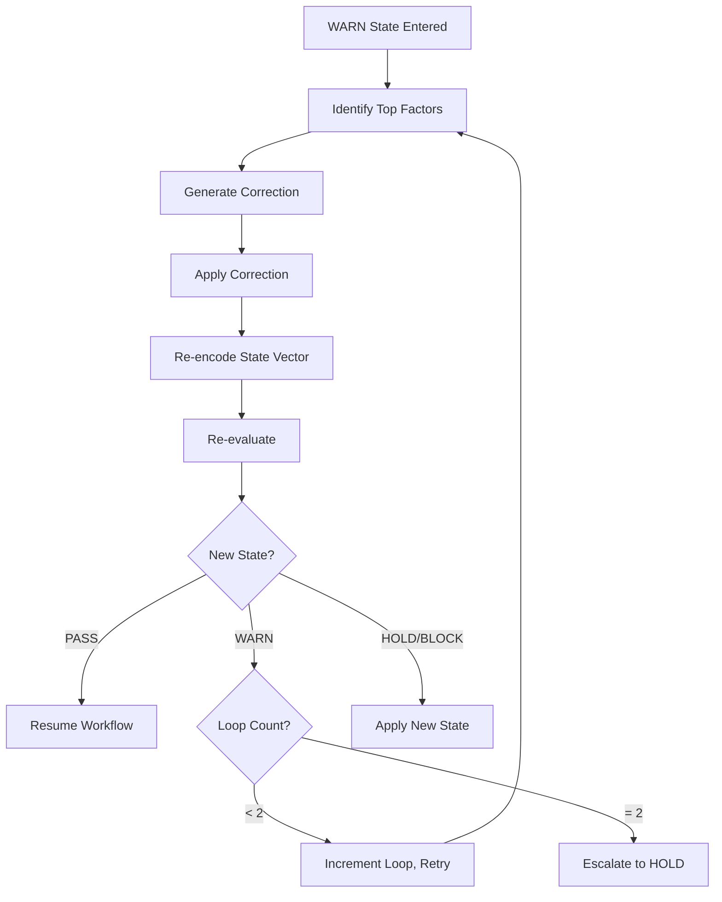
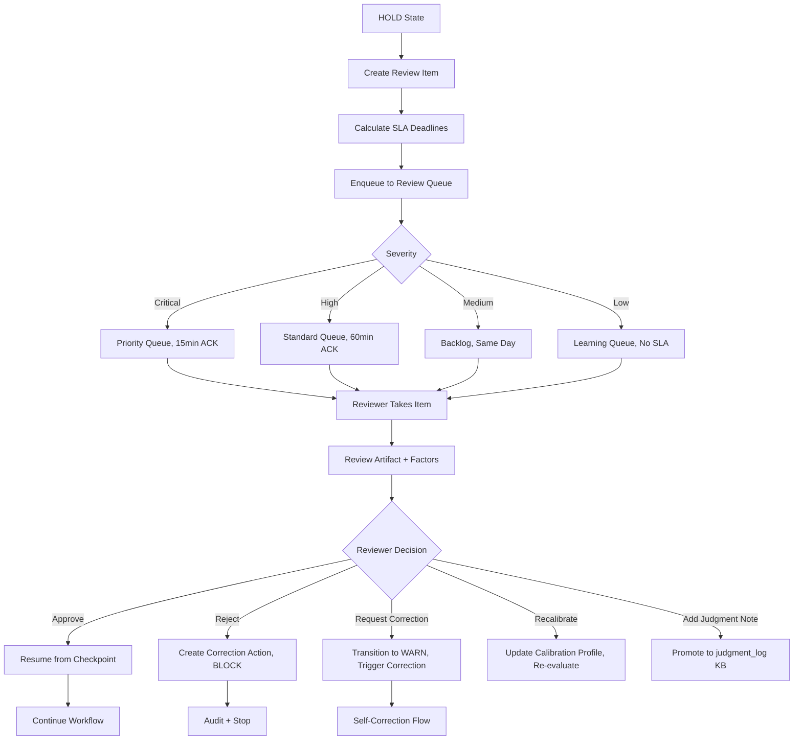
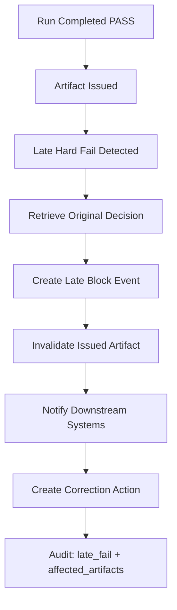
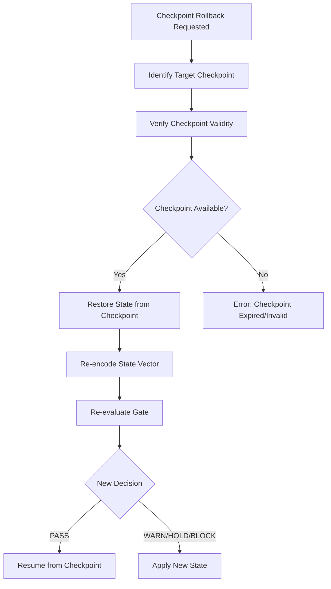
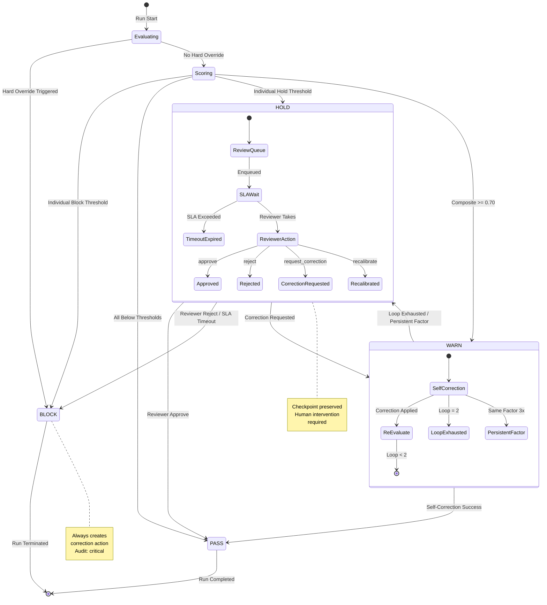
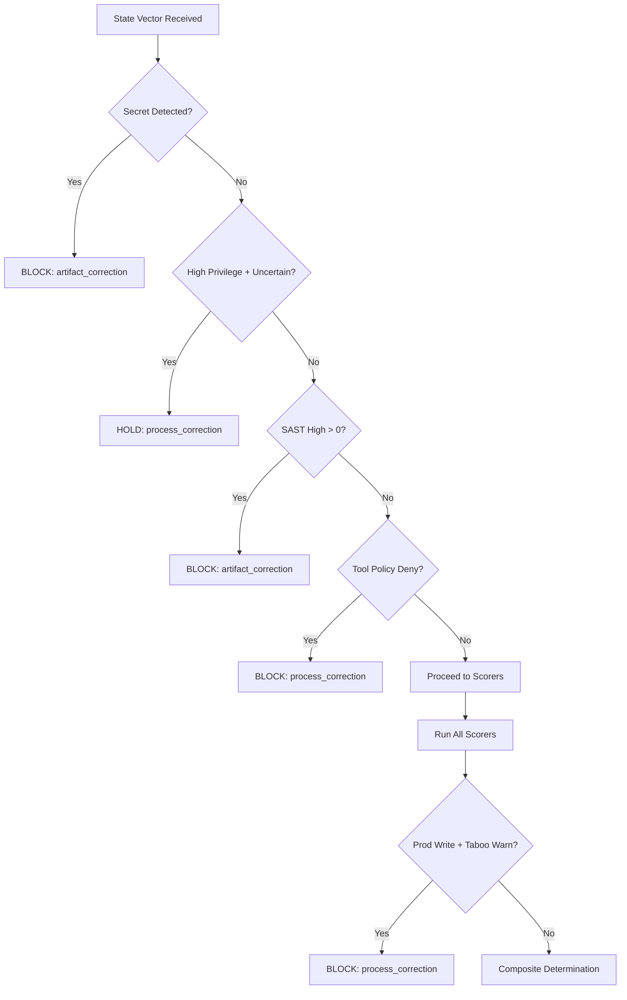
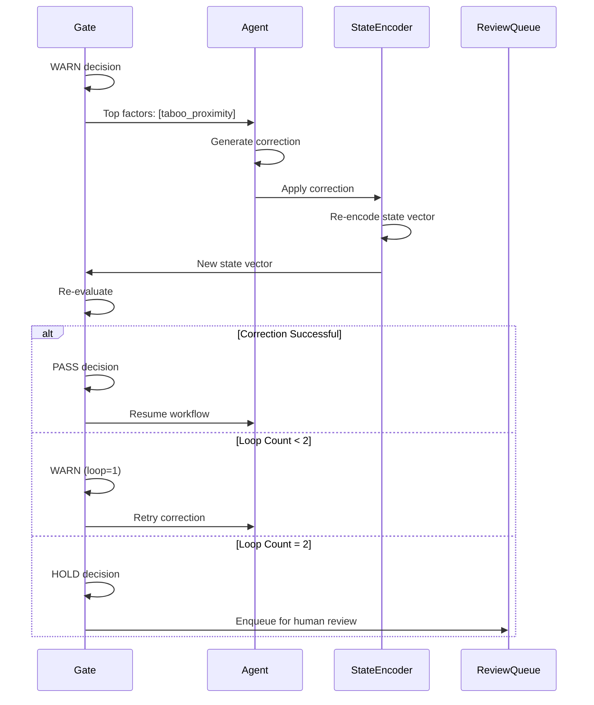
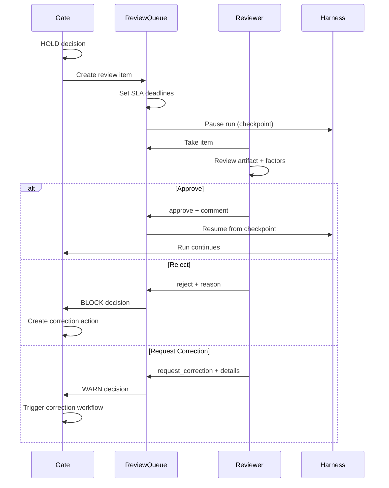

# State Transition Specification

This document specifies the complete state transition logic for the agent-gatefield gate system. It defines gate states, transition rules, hard override mechanisms, composite scoring, self-correction flows, review workflows, and edge case handling.

## Document Version

| Version | Date | Changes |
|---|---|---|
| 1.0.0 | 2026-04-26 | Initial specification from requirements.md frozen state |

---

## 1. Gate States

The gate system uses four canonical states representing progressively more severe intervention levels.

### 1.1 State Definitions

| State | Code | Definition | Workflow Impact |
|---|---|---|---|
| `PASS` | `pass` | Artifact and process are within acceptable bounds. No intervention required. | Continue workflow uninterrupted |
| `WARN` | `warn` | Artifact or process shows elevated risk indicators but remains below critical thresholds. Self-correction recommended. | Pause for self-correction, allow re-evaluation (max 2 loops) |
| `HOLD` | `hold` | Significant risk detected requiring human judgment before proceeding. Cannot proceed autonomously. | Pause run, enqueue for human review, maintain checkpoint |
| `BLOCK` | `block` | Critical violation or hard override triggered. Workflow must stop. | Terminate run, create correction action, log audit event |

### 1.2 State Severity Mapping

```
PASS < WARN < HOLD < BLOCK (increasing intervention severity)

Conservative ordering: Higher risk state always prevails in conflict
```

### 1.3 State Properties

| Property | PASS | WARN | HOLD | BLOCK |
|---|---|---|---|---|
| Autonomous continuation | Yes | Conditional (after correction) | No | No |
| Human intervention | No | Optional | Required | Post-event |
| Checkpoint preservation | Not needed | Preserved | Preserved | Preserved for audit |
| Correction action created | No | Optional | On reject | Always |
| Audit event logged | Yes | Yes | Yes | Yes (critical) |

---

## 2. State Transition Table

All state transitions with complete condition, action, audit, and priority specifications.

### 2.1 Primary Transitions

| ID | Current State | Trigger Condition | Next State | Action Taken | Audit Required | Priority |
|---|---|---|---|---|---|---|
| T01 | `any` | Static gate hard fail (secret, sast_high, lint_error) | `BLOCK` | Stop run, create `artifact_correction`, log evidence | `static_gate_result`, `evidence_ref`, `policy_version` | P0-Critical |
| T02 | `any` | `block_if_secret_found` hard override: `rule_violation.secret > 0` | `BLOCK` | Immediate block, create `artifact_correction` | `secret_type`, `detection_method`, `content_hash` | P0-Critical |
| T03 | `any` | `tool_policy_deny`: tool matches deny pattern | `BLOCK` | Stop tool execution, create `process_correction` | `tool_name`, `deny_pattern_matched`, `policy_version` | P0-Critical |
| T04 | `any` | `block_if_prod_write_and_taboo_warn`: `prod_write=1` AND `taboo_score >= taboo_warn` | `BLOCK` | Immediate block for production safety | `prod_write_context`, `taboo_score`, `taboo_docs_ref` | P0-Critical |
| T05 | `any` | `hold_if_high_privilege_and_uncertain`: `high_privilege=1` AND (`judge_std > 0.15` OR `tool_error_rate > 0.10`) | `HOLD` | Pause run, enqueue review queue | `privilege_level`, `uncertainty_factors`, `checkpoint_ref` | P0-High |
| T06 | `PASS` | `composite_score >= 0.70` AND no hard override | `WARN` | Initiate self-correction loop | `composite_score`, `top_factors`, `threshold_version` | P1 |
| T07 | `PASS` | `taboo_score >= taboo_warn` (0.80) AND `taboo_score < taboo_block` | `HOLD` | Enqueue for human review | `taboo_score`, `taboo_docs_ref`, `threshold_version` | P1 |
| T08 | `PASS` | `reject_score >= reject_warn` (0.75) AND `reject_score < reject_block` | `HOLD` | Enqueue for human review | `reject_score`, `reject_docs_ref`, `reject_reasons` | P1 |
| T09 | `PASS` | `anomaly_score >= 0.95` (P95 percentile) AND `anomaly_score < 0.99` | `HOLD` | Enqueue for human review | `anomaly_score`, `trajectory_features`, `method` | P1 |
| T10 | `PASS` | `uncertainty_score >= judge_std_block` (0.25) | `HOLD` | Enqueue for human review (high uncertainty) | `uncertainty_factors`, `judge_std`, `tool_error_rate` | P1 |
| T11 | `PASS` | `anomaly_score >= 0.90` AND `anomaly_score < 0.95` | `WARN` | Self-correction allowed | `anomaly_score`, `trajectory_features` | P2 |
| T12 | `PASS` | `uncertainty_score >= judge_std_warn` (0.15) AND `uncertainty_score < judge_std_block` | `WARN` | Self-correction allowed | `uncertainty_score`, `factors` | P2 |

### 2.2 Block Threshold Transitions

| ID | Current State | Trigger Condition | Next State | Action Taken | Audit Required | Priority |
|---|---|---|---|---|---|---|
| T13 | `any` | `taboo_score >= taboo_block` (0.88) | `BLOCK` | Create `process_correction`, stop run | `taboo_score`, `taboo_topk_refs`, `risk_class` | P0-Critical |
| T14 | `any` | `reject_score >= reject_block` (0.85) | `BLOCK` | Create `artifact_correction`, stop run | `reject_score`, `reject_docs_ref`, `expected_state` | P0-Critical |
| T15 | `any` | `anomaly_score >= 0.99` (P99 percentile) | `BLOCK` | Create `process_correction`, stop run | `anomaly_score`, `feature_values`, `detection_method` | P0-Critical |

### 2.3 Self-Correction Transitions

| ID | Current State | Trigger Condition | Next State | Action Taken | Audit Required | Priority |
|---|---|---|---|---|---|---|
| T16 | `WARN` | Self-correction successful AND `composite_score < 0.70` AND same top factor resolved | `PASS` | Resume workflow, log correction result | `correction_type`, `before_score`, `after_score`, `correction_reason` | P1 |
| T17 | `WARN` | Self-correction loop count = 2 AND still `WARN` state | `HOLD` | Escalate to human review (max loops exceeded) | `loop_count`, `persistent_factors`, `checkpoint_ref` | P1 |
| T18 | `WARN` | Same top factor persists for 3 consecutive runs | `HOLD` | Escalate to human review (repeated pattern) | `repeated_warn_count`, `persistent_factor`, `run_ids` | P1 |

### 2.4 Human Review Transitions

| ID | Current State | Trigger Condition | Next State | Action Taken | Audit Required | Priority |
|---|---|---|---|---|---|---|
| T19 | `HOLD` | Reviewer approves | `PASS` | Resume from checkpoint, log approval | `reviewer_id`, `comment`, `decision_time`, `checkpoint_ref` | P0 |
| T20 | `HOLD` | Reviewer rejects | `BLOCK` | Create correction action, stop run | `reviewer_id`, `reject_reason`, `required_correction`, `comment` | P0 |
| T21 | `HOLD` | Reviewer requests `artifact_correction` | `WARN` | Trigger artifact correction workflow | `reviewer_id`, `correction_target`, `correction_details` | P1 |
| T22 | `HOLD` | Reviewer requests `process_correction` | `WARN` | Trigger process correction workflow | `reviewer_id`, `correction_target`, `correction_details` | P1 |
| T23 | `HOLD` | Reviewer requests `prompt_correction` | `WARN` | Trigger prompt correction workflow | `reviewer_id`, `correction_target`, `prompt_changes` | P1 |
| T24 | `HOLD` | Reviewer recalibrates thresholds | `HOLD` | Update calibration profile, re-evaluate | `reviewer_id`, `threshold_changes`, `profile_version` | P1 |

### 2.5 SLA and Timeout Transitions

| ID | Current State | Trigger Condition | Next State | Action Taken | Audit Required | Priority |
|---|---|---|---|---|---|---|
| T25 | `HOLD` | SLA ACK timeout exceeded (Critical: 15min, High: 60min) | `BLOCK` | Fail closed, escalation notification | `timeout_type`, `sla_deadline`, `escalation_target` | P0-Critical |
| T26 | `HOLD` | SLA decision timeout exceeded (Critical: 60min, High: 240min) | `BLOCK` | Fail closed, escalation notification | `timeout_type`, `sla_deadline`, `escalation_target` | P0-Critical |

### 2.6 Late Fail Transitions (Edge Cases)

| ID | Current State | Trigger Condition | Next State | Action Taken | Audit Required | Priority |
|---|---|---|---|---|---|---|
| T27 | `PASS` (post-run) | Late hard fail detected (e.g., delayed SAST, retrospective incident) | `BLOCK` | Invalidate issued artifact, downstream stop | `late_fail_type`, `original_decision_id`, `affected_artifacts`, `detection_time` | P0-Critical |
| T28 | `PASS` (checkpoint rollback) | Checkpoint rollback requested due to upstream failure | `HOLD` | Re-evaluate from checkpoint, pause | `rollback_reason`, `checkpoint_ref`, `upstream_failure_ref` | P1 |

---

## 3. Hard Override Rules

Hard overrides are deterministic rules that bypass composite scoring and produce immediate state transitions. They are evaluated before scorers run.

### 3.1 Override Rule Definitions

| Rule ID | Rule Name | Trigger Condition | Outcome | Action Type | Bypass Composite? |
|---|---|---|---|---|---|
| HO01 | `block_if_secret_found` | `rule_violation.secret > 0` | `BLOCK` | `artifact_correction` | Yes |
| HO02 | `block_if_prod_write_and_taboo_warn` | `risk.prod_write == 1` AND `taboo_score >= taboo_warn (0.80)` | `BLOCK` | `process_correction` | Partial (needs taboo scorer) |
| HO03 | `hold_if_high_privilege_and_uncertain` | `risk.high_privilege == 1` AND (`uncertainty.judge_std > 0.15` OR `uncertainty.tool_error_rate > 0.10`) | `HOLD` | `process_correction` | Yes |
| HO04 | `static_gate_sast_high` | `rule_violation.sast_high > 0` | `BLOCK` | `artifact_correction` | Yes |
| HO05 | `tool_policy_deny` | `rule_violation.tool_policy_deny > 0` | `BLOCK` | `process_correction` | Yes |

### 3.2 Override Evaluation Order

Hard overrides are evaluated in this specific order before composite scoring:

```python
# Evaluation sequence (engine.py _apply_hard_overrides)
def _apply_hard_overrides(state_vector: Dict) -> Optional[DecisionResult]:
    # 1. block_if_secret_found (immediate, no dependencies)
    if rule_violation.get('secret', 0) > 0:
        return BLOCK
    
    # 2. hold_if_high_privilege_and_uncertain (no scorer dependency)
    if risk.get('high_privilege', 0) == 1:
        if uncertainty conditions met:
            return HOLD
    
    # 3. static_gate_sast_high (immediate)
    if rule_violation.get('sast_high', 0) > 0:
        return BLOCK
    
    # 4. tool_policy_deny (immediate)
    if rule_violation.get('tool_policy_deny', 0) > 0:
        return BLOCK
    
    # 5. block_if_prod_write_and_taboo_warn (requires taboo scorer)
    # Evaluated after scorers in _determine_state
    
    return None  # No override, proceed to scorers
```

### 3.3 Override DecisionResult Structure

When a hard override triggers, the DecisionResult includes:

```json
{
  "decision": "block" | "hold",
  "composite_score": 1.0 (block) | 0.85 (hold),
  "scorer_results": [],
  "factors": ["Override trigger reason"],
  "exemplar_refs": [],
  "action_type": "artifact_correction" | "process_correction",
  "threshold_version": "current_version",
  "hard_override_reason": "block_if_secret_found" | "static_gate_sast_high" | ...
}
```

---

## 4. Composite Scoring Logic

The composite score aggregates multiple scorer outputs into a single risk metric.

### 4.1 Scorer Components

| Scorer | Weight | Formula | Direction | Threshold Usage |
|---|---|---|---|---|
| `constitution_alignment` | 0.20 | `cosine(semantic, constitution_centroid)` | Higher = better (aligned) | Not direct threshold, contributes to composite |
| `taboo_proximity` | 0.30 | `max cosine(semantic, taboo_topk)` | Higher = worse (risky) | Direct: warn=0.80, block=0.88 |
| `accept_similarity` | 0.10 | `max cosine(semantic, accepted_topk)` | Higher = better (safe) | Not direct threshold |
| `reject_similarity` | 0.15 | `max cosine(semantic, rejected_topk)` | Higher = worse (risky) | Direct: warn=0.75, block=0.85 |
| `drift` | 0.10 | `1 - cosine(current, ewma_accepted)` | Higher = worse (drifting) | P95/P99 from accepted distribution |
| `anomaly` | 0.10 | Isolation Forest percentile or Mahalanobis | Higher = worse (anomalous) | Percentile: warn=P95, block=P99 |
| `uncertainty` | 0.05 | `(judge_std + confidence_gap + tool_error + evidence_gap) / 4` | Higher = worse (uncertain) | Direct: warn=0.15, block=0.25 |

### 4.2 Composite Score Calculation

```python
composite_score = sum(scorer_result.weighted_score for scorer_result in all_results)

# Weighted score per scorer
weighted_score = raw_score * weight

# Example:
# taboo_proximity: 0.85 * 0.30 = 0.255
# reject_similarity: 0.72 * 0.15 = 0.108
# drift: 0.12 * 0.10 = 0.012
# anomaly: 0.05 * 0.10 = 0.005
# uncertainty: 0.18 * 0.05 = 0.009
# constitution_alignment: 0.65 * 0.20 = 0.130 (safe, subtracted conceptually)
# accept_similarity: 0.80 * 0.10 = 0.080 (safe, subtracted conceptually)

# Composite focuses on risk factors; alignment scores reduce perceived risk
```

### 4.3 Threshold Comparison

The composite score is compared against state thresholds:

| Threshold | Value | State if Exceeded |
|---|---|---|
| `composite_warn` | 0.70 | `WARN` |
| Individual scorer thresholds | See 4.1 | Direct state determination |

**Important**: Individual scorer thresholds (taboo, reject, anomaly, uncertainty) can trigger HOLD or BLOCK independently of composite score. The composite is used for general WARN elevation when no specific threshold is crossed.

### 4.4 State Determination Logic

```python
def _determine_state(composite_score, scorer_results, state_vector):
    # Extract individual scores
    taboo_score = get_score('taboo_proximity')
    reject_score = get_score('reject_similarity')
    anomaly_score = get_score('anomaly')
    uncertainty_score = get_score('uncertainty')
    
    # Block conditions (highest priority)
    if taboo_score >= taboo_block (0.88):
        return BLOCK, "process_correction"
    if reject_score >= reject_block (0.85):
        return BLOCK, "artifact_correction"
    if anomaly_score >= 0.99:
        return BLOCK, "process_correction"
    
    # Hard override: prod_write + taboo_warn (after scorers)
    if hard_overrides['block_if_prod_write_and_taboo_warn']:
        if risk['prod_write'] == 1 and taboo_score >= taboo_warn (0.80):
            return BLOCK, "process_correction"
    
    # Hold conditions
    if taboo_score >= taboo_warn (0.80):
        return HOLD, "human_review"
    if reject_score >= reject_warn (0.75):
        return HOLD, "human_review"
    if anomaly_score >= 0.95:
        return HOLD, "human_review"
    if uncertainty_score >= judge_std_block (0.25):
        return HOLD, "human_review"
    
    # Warn conditions
    if composite_score >= 0.70:
        return WARN, "self_correction"
    if anomaly_score >= 0.90:
        return WARN, "self_correction"
    if uncertainty_score >= judge_std_warn (0.15):
        return WARN, "self_correction"
    
    # Pass
    return PASS, "continue"
```

---

## 5. Self-Correction Loop

The WARN state enables autonomous self-correction with bounded retry limits.

### 5.1 Self-Correction Flow



### 5.2 Loop Parameters

| Parameter | Value | Description |
|---|---|---|
| `max_self_correction_loops` | 2 | Maximum autonomous correction attempts |
| `loop_tracking_field` | `self_correction_count` | Counter in DecisionResult |
| `persistent_factor_threshold` | 3 consecutive runs | Same top factor across runs triggers HOLD |

### 5.3 Self-Correction Actions

Self-correction can apply one of three correction types based on top factors:

| Top Factor | Correction Type | Example Actions |
|---|---|---|
| `taboo_proximity` | `process_correction` | Refactor code, add validation, change approach |
| `reject_similarity` | `artifact_correction` | Modify output to avoid rejected pattern |
| `drift` | `process_correction` | Adjust trajectory, reduce deviation |
| `anomaly` | `process_correction` | Normalize behavior, reduce tool calls |
| `uncertainty` | `prompt_correction` | Clarify intent, add context |

### 5.4 Loop Exhaustion Handling

When self-correction loops exhaust (count = 2):

1. State transitions to `HOLD`
2. Review queue item created with `severity: high`
3. `persistent_factors` field populated with unresolvable factors
4. `self_correction_history` logged in audit

### 5.5 Persistent Factor Escalation

If the same top factor appears in WARN state for 3 consecutive runs:

1. State transitions to `HOLD` regardless of loop count
2. Pattern analysis triggered
3. Calibration profile review recommended
4. `repeated_warn_count` logged

---

## 6. Review Flow

The HOLD state requires human intervention through the review queue.

### 6.1 Review Queue Flow



### 6.2 Review Item Structure

```json
{
  "review_id": "uuid",
  "decision_id": "uuid",
  "run_id": "uuid",
  "state": "hold",
  "composite_score": 0.72,
  "severity": "critical" | "high" | "medium" | "low",
  "top_factors": ["taboo_proximity", "uncertainty_score"],
  "exemplar_refs": ["taboo-001", "accepted-023"],
  "artifact_ref": "artifact://...",
  "trace_ref": "trace://...",
  "checkpoint_ref": "checkpoint://...",
  "sla_ack_deadline": "RFC3339",
  "sla_decision_deadline": "RFC3339",
  "assigned_to": null | "reviewer_id",
  "taken_at": null | "RFC3339",
  "resolved_at": null | "RFC3339"
}
```

### 6.3 SLA Requirements

| Severity | ACK Deadline | Decision Deadline | Timeout Action |
|---|---|---|---|
| Critical | 15 minutes | 60 minutes | BLOCK (fail closed) |
| High | 60 minutes | 240 minutes | BLOCK (fail closed) |
| Medium | Same business day | Next business day | Escalation to High |
| Low | N/A | Backlog | No timeout |

### 6.4 Reviewer Actions

| Action | State Change | Post-Action |
|---|---|---|
| `approve` | HOLD -> PASS | Resume from checkpoint, log approval |
| `reject` | HOLD -> BLOCK | Create correction action, stop run |
| `request_artifact_correction` | HOLD -> WARN | Trigger artifact correction workflow |
| `request_process_correction` | HOLD -> WARN | Trigger process correction workflow |
| `request_prompt_correction` | HOLD -> WARN | Trigger prompt correction workflow |
| `recalibrate` | HOLD (re-evaluate) | Update calibration profile, re-run evaluation |
| `add_judgment_note` | No change | Promote to judgment_log KB (optional) |

### 6.5 Review Resolution Audit

Required audit fields for review resolution:

```json
{
  "event_type": "human_review",
  "actor": "reviewer",
  "reviewer_id": "string",
  "previous_decision": "hold",
  "new_decision": "pass" | "block" | "warn",
  "comment": "redacted string (max 1000 chars)",
  "correction": {
    "correction_type": "artifact" | "process" | "prompt",
    "target": "string",
    "details": "object"
  },
  "decision_time": "RFC3339",
  "sla_compliance": boolean
}
```

---

## 7. Correction Actions

Three types of correction actions are supported based on the nature of the issue.

### 7.1 Artifact Correction

**Trigger**: Issues with the generated artifact itself (code, document, output).

| Field | Value |
|---|---|
| `action_type` | `artifact_correction` |
| `target` | Artifact ID or specific component |
| `examples` | Remove dangerous output, fix SQL injection pattern, add missing tests, correct design violation |

**Common Triggers**:
- `block_if_secret_found`: Secret detected in artifact
- `reject_similarity >= reject_block`: Artifact matches rejected pattern
- `sast_high`: Static analysis high severity finding

### 7.2 Process Correction

**Trigger**: Issues with the execution process, trajectory, or workflow.

| Field | Value |
|---|---|
| `action_type` | `process_correction` |
| `target` | Process step, tool, or workflow component |
| `examples` | Add additional static scan, reduce tool permissions, checkpoint rollback, handoff to specialist agent, force human review |

**Common Triggers**:
- `block_if_prod_write_and_taboo_warn`: Production write with taboo proximity
- `taboo_proximity >= taboo_block`: Process approaching forbidden operation
- `anomaly_score >= 0.99`: Anomalous trajectory
- `tool_policy_deny`: Denied tool invocation

### 7.3 Prompt Correction

**Trigger**: Issues with the input context, instructions, or agent configuration.

| Field | Value |
|---|---|
| `action_type` | `prompt_correction` |
| `target` | System prompt, few-shot, tool schema, or configuration |
| `examples` | Add taboo to system prompt, update few-shot examples, constrain tool schema, enhance retrieval filter, adjust effort budget |

**Common Triggers**:
- Repeated uncertainty issues (low confidence patterns)
- Persistent drift from intended direction
- Calibration profile adjustment
- Reviewer recommendation for prompt improvement

### 7.4 Correction Action Structure

```json
{
  "correction_id": "uuid",
  "run_id": "uuid",
  "decision_id": "uuid",
  "correction_type": "artifact" | "process" | "prompt",
  "target": "string",
  "details": {
    "issue_description": "string",
    "recommended_fix": "string",
    "priority": "low" | "medium" | "high",
    "blocking_factors": ["list"]
  },
  "created_at": "RFC3339",
  "applied_at": null | "RFC3339",
  "status": "pending" | "applied" | "failed" | "superseded"
}
```

---

## 8. Priority Ordering

State determination follows a strict priority hierarchy to ensure conservative (safety-first) behavior.

### 8.1 Priority Hierarchy

```
Priority 1 (Highest): Hard Override Rules
    - block_if_secret_found
    - static_gate_sast_high
    - tool_policy_deny
    - hold_if_high_privilege_and_uncertain
    - block_if_prod_write_and_taboo_warn

Priority 2: Tool Policy (harness-level)
    - deny_on_match patterns
    - hold patterns

Priority 3: Data Protection Policy
    - restricted payload handling
    - pii-sensitive classification

Priority 4: Reviewer Decision
    - approve/reject/correction request
    - recalibration

Priority 5: Composite Score + Individual Thresholds
    - taboo_block > taboo_warn
    - reject_block > reject_warn
    - anomaly_block_percentile > anomaly_warn_percentile
    - judge_std_block > judge_std_warn
    - composite_warn threshold

Priority 6: Self-Correction Result
    - success -> PASS
    - failure -> HOLD
```

### 8.2 Conflict Resolution

When multiple signals conflict:

1. **More conservative state wins**: BLOCK > HOLD > WARN > PASS
2. **Earlier priority level wins**: Hard override bypasses composite
3. **Specific threshold wins**: taboo_block overrides composite_warn
4. **Human decision wins within HOLD**: Reviewer decision overrides prior state

### 8.3 Example Conflict Resolution

| Scenario | Signals | Resolution | Reason |
|---|---|---|---|
| High accept_similarity + High taboo_proximity | accept=0.90, taboo=0.88 | BLOCK | taboo_block threshold wins |
| Low composite + High privilege uncertainty | composite=0.50, high_priv=1, judge_std=0.20 | HOLD | Hard override (HO03) wins |
| Self-correction success + New anomaly detected | correction OK, anomaly=0.97 | HOLD | anomaly_warn threshold wins over correction |
| Reviewer approve + SLA timeout | approve received at 61min (Critical) | BLOCK | SLA timeout is fail closed |

---

## 9. Edge Cases

Special handling for exceptional scenarios that deviate from the primary flow.

### 9.1 Late Hard Fail

**Scenario**: A hard fail condition is detected after the run has completed with PASS state.

**Example**: Delayed SAST scan result, retrospective security incident identification, post-merge vulnerability discovery.

**Handling**:



**Required Audit Fields**:
- `original_decision_id`: The PASS decision that is now superseded
- `late_fail_type`: Type of late detection (sast, secret, incident, etc.)
- `detection_time`: When the late fail was discovered
- `affected_artifacts`: List of artifacts impacted
- `remediation_action`: Corrective steps taken

### 9.2 SLA Expiration (Fail Closed)

**Scenario**: Review queue item exceeds SLA deadline without human action.

**Handling**:

| Stage | Action |
|---|---|
| ACK deadline passed | Escalation notification to backup reviewer |
| Decision deadline passed | Automatic BLOCK (fail closed) |
| Post-timeout resolution | Human decision still logged but BLOCK remains |

**Required Audit Fields**:
- `timeout_type`: `ack_timeout` or `decision_timeout`
- `sla_deadline`: The exceeded deadline timestamp
- `escalation_target`: Who was notified
- `auto_block_reason`: "sla_timeout_fail_closed"

### 9.3 Checkpoint Rollback

**Scenario**: Rollback to a previous checkpoint is requested due to upstream failure or detected issue in current state.

**Handling**:



**Required Audit Fields**:
- `rollback_reason`: Why rollback was requested
- `source_checkpoint_ref`: Current checkpoint being abandoned
- `target_checkpoint_ref`: Checkpoint to restore
- `upstream_failure_ref`: Reference to triggering failure

### 9.4 Harness Pause/Resume Unavailable

**Scenario**: Harness cannot support pause/resume (checkpoint not available).

**Handling**:

| Normal Flow | Fallback Behavior |
|---|---|
| HOLD -> Pause -> Resume | HOLD treated as BLOCK (fail closed) |
| Self-correction with checkpoint | Self-correction allowed if harness supports |
| Review approval resume | Review approval logs pass but run must restart |

**Mitigation**: Add harness adapter capability check at initialization. If `checkpointing: false`, document that HOLD behaves as BLOCK.

### 9.5 KB Unavailable

**Scenario**: Judgment knowledge base (vector store) is unavailable during evaluation.

**Handling**:

| KB Component | Fallback |
|---|---|
| Constitution embeddings | Constitution alignment score = 0.5 (neutral) |
| Taboo embeddings | Taboo score = 0.0 (no detection possible) |
| Accepted embeddings | Accept similarity = 0.0 |
| Rejected embeddings | Reject similarity = 0.0 |
| All KB unavailable | Proceed with rule_violation, uncertainty only; log KB outage |

**Audit**: `kb_unavailable: true`, `unavailable_axes: [...]`

### 9.6 Cost Budget Exceeded

**Scenario**: Monthly cost budget threshold exceeded (80% warn, 100% hold).

**Handling**:

| Threshold | Action |
|---|---|
| 80% of budget | System-wide WARN, cost alert sent |
| 100% of budget | New runs BLOCKed with `cost_budget_exceeded` reason |

**Audit**: `cost_budget_percent`, `cost_hold_reason`

---

## 10. State Diagram

Complete state machine diagram using Mermaid notation.

### 10.1 Primary State Machine



### 10.2 Hard Override Decision Flow



### 10.3 Self-Correction Loop Detail



### 10.4 Human Review Flow Detail



---

## 11. Audit Requirements

All state transitions must log specific audit fields for traceability and replay.

### 11.1 Required Audit Fields by Transition

| Transition Type | Required Fields |
|---|---|
| Hard Override BLOCK | `hard_override_reason`, `trigger_value`, `policy_version` |
| Threshold BLOCK | `threshold_type`, `threshold_value`, `score_value`, `threshold_version` |
| WARN -> Self-Correction | `loop_count`, `top_factors`, `correction_type` |
| WARN -> PASS (correction success) | `before_score`, `after_score`, `correction_details` |
| WARN -> HOLD (loop exhausted) | `loop_count`, `persistent_factors` |
| HOLD -> Review Queue | `checkpoint_ref`, `sla_deadlines`, `severity` |
| HOLD -> PASS (approve) | `reviewer_id`, `comment`, `decision_time`, `sla_compliance` |
| HOLD -> BLOCK (reject) | `reviewer_id`, `reject_reason`, `required_correction` |
| HOLD -> BLOCK (SLA timeout) | `timeout_type`, `sla_deadline`, `escalation_target` |
| Late Fail BLOCK | `original_decision_id`, `late_fail_type`, `affected_artifacts` |

### 11.2 Audit Event Schema

```json
{
  "event_id": "uuid",
  "trace_id": "OTel trace ID",
  "span_id": "OTel span ID",
  "run_id": "uuid",
  "event_type": "gate_decision" | "human_review" | "correction" | "state_transition",
  "actor": "agent" | "reviewer" | "system",
  "payload_hash": "sha256 hash",
  "retention_class": "audit" | "ops" | "pii-sensitive",
  "threshold_version": "hash",
  "policy_version": "version string",
  "created_at": "RFC3339",
  "expires_at": "RFC3339 (based on retention)"
}
```

### 11.3 Retention Policy

| Event Type | Retention Class | Duration |
|---|---|---|
| All gate decisions | `audit` | 365 days |
| Human review actions | `audit` | 365 days |
| Correction actions | `audit` | 365 days |
| State transitions | `audit` | 365 days |
| Self-correction attempts | `ops` | 90 days |
| Review queue metadata | `ops` | 90 days |

---

## 12. Configuration Parameters

All thresholds and parameters are configurable via `gate-config.yaml` or calibration profiles.

### 12.1 Threshold Parameters

| Parameter | Default | Range | Calibration Source |
|---|---|---|---|
| `taboo_warn` | 0.80 | 0.0-1.0 | Accepted distribution P95 |
| `taboo_block` | 0.88 | 0.0-1.0 | Accepted distribution P99 |
| `reject_warn` | 0.75 | 0.0-1.0 | Reject corpus analysis |
| `reject_block` | 0.85 | 0.0-1.0 | Reject corpus analysis |
| `anomaly_warn_percentile` | 95 | 90-99 | Contamination estimate |
| `anomaly_block_percentile` | 99 | 95-99 | Contamination estimate |
| `judge_std_warn` | 0.15 | 0.0-1.0 | Evaluator disagreement distribution |
| `judge_std_block` | 0.25 | 0.0-1.0 | Evaluator disagreement distribution |
| `composite_warn` | 0.70 | 0.0-1.0 | Offline eval calibration |

### 12.2 Loop and Limit Parameters

| Parameter | Default | Range |
|---|---|---|
| `max_self_correction_loops` | 2 | 0-5 |
| `persistent_factor_threshold` | 3 | 1-10 |

### 12.3 Hard Override Enable/Disable

| Override | Default | Configurable |
|---|---|---|
| `block_if_secret_found` | true | Yes |
| `block_if_prod_write_and_taboo_warn` | true | Yes |
| `hold_if_high_privilege_and_uncertain` | true | Yes |

### 12.4 SLA Parameters

| Severity | ACK Default | Decision Default |
|---|---|---|
| Critical | 15 min | 60 min |
| High | 60 min | 240 min |
| Medium | Same day | Next day |

---

## Appendix A: Acceptance Criteria Mapping

| Transition | Requirement | Acceptance Criteria |
|---|---|---|
| Hard Override -> BLOCK | AGF-REQ-002 | 100% block on seeded static violations |
| Threshold -> HOLD | AGF-REQ-004 | High privilege action gated by risk/uncertainty |
| Self-Correction Loop | AGF-REQ-004 | Max 2 loops, persistent factor escalation |
| Review Flow | AGF-REQ-005 | Correction reflected in judgment log |
| SLA Timeout | AGF-REQ-004 | Fail closed, escalation notification |
| Late Fail | AGF-REQ-002 | Downstream stop, artifact invalidation |

---

## Appendix B: Implementation Reference

| Component | Module | Key Method |
|---|---|---|
| State determination | `src/core/engine.py` | `_determine_state()` |
| Hard overrides | `src/core/engine.py` | `_apply_hard_overrides()` |
| Composite scoring | `src/scorers/__init__.py` | `CompositeScorer.compute_composite()` |
| Self-correction | `src/core/engine.py` | `max_correction_loops config` |
| Review queue | `src/review/queue.py` | `enqueue(), take(), resolve()` |
| Audit logging | `src/audit/logger.py` | `log_decision(), log_review()` |

---

## Version History

| Version | Date | Changes |
|---|---|---|
| 1.0.0 | 2026-04-26 | Initial specification from requirements.md frozen state |
